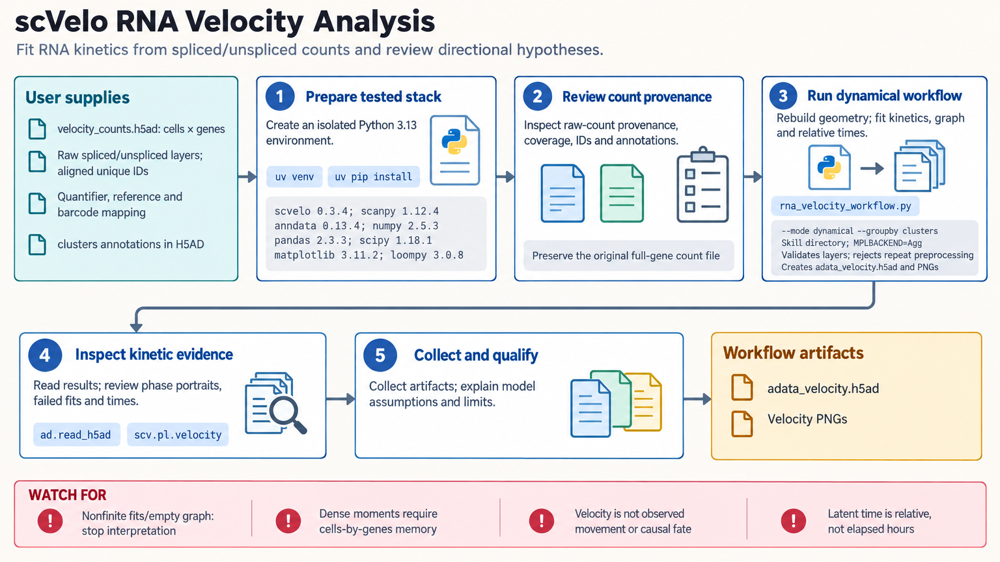

[All skill guides](README.md) / scVelo

# scVelo

**Explore directional cell-state hypotheses from spliced and unspliced RNA measurements.**

The scVelo skill guides RNA velocity analysis using paired spliced and unspliced single-cell counts. It fits supported kinetic models, examines gene-level phase portraits, and builds relative trajectory summaries. The workflow emphasizes checking whether individual genes and measurement coverage support the direction suggested by an embedding.

*From RNA processing measurements to model-based cell-state direction hypotheses.
[View the full-size workflow diagram](../images/scvelo.png).*

## Questions this skill can help you explore

- **Which expression changes does the kinetic model suggest?** Estimate local derivatives under a declared deterministic or dynamical model.
- **Do the genes support a directional interpretation?** Examine phase portraits, fitted parameters, coverage, and failed fits.
- **How sensitive are trajectories to analysis choices?** Compare gene sets, neighbors, subsampling, and model assumptions.
- **What independent evidence could test the direction?** Relate hypotheses to time courses, perturbations, labeling, or lineage information.

## What you bring

Provide an AnnData dataset with aligned spliced and unspliced count layers, unique cell and gene identifiers, and sample metadata. Include the velocity-aware quantifier, reference annotation, counting mode, and barcode mapping used upstream.

Explain prior quality control, cell-state coverage, and any independent time or lineage evidence. Logged, scaled, residualized, or batch-corrected expression cannot substitute for the required count layers.

## How the analysis works

1. **Validate the measurements.** Check layer alignment, count provenance, coverage, zero-count cells, annotation compatibility, and sample quality.
2. **Prepare and choose the model.** Use an appropriate gene set and neighborhood representation while retaining the relevant count history.
3. **Fit kinetic behavior.** Run the supported estimator and inspect gene-level fits, missing parameters, and state coverage.
4. **Construct directional summaries.** Compute velocity graphs, projections, and relative time coordinates where appropriate.
5. **Challenge the interpretation.** Test sensitivity and compare the proposed direction with independent biological evidence.

## What you get

| Output | What it helps you do |
| --- | --- |
| Gene phase portraits and fit diagnostics | Evaluate whether individual genes support the kinetic model. |
| Velocity estimates and graphs | Explore model-implied local expression changes. |
| Embedding overlays and relative times | Summarize directional hypotheses for review. |
| Saved analysis dataset | Retain fitted quantities and provenance for follow-up. |

## Example request

> Use the scVelo skill to examine my aligned spliced and unspliced counts. Check measurement provenance and kinetic-state coverage, inspect phase portraits for key genes, and test sensitivity to the neighborhood and gene selection. Compare any directional interpretation with my independent collection-time labels and flag conflicting evidence.

*This is an illustrative analysis request, not a demonstrated lineage or fate result.*

## Interpreting the results

**Smooth arrows are not observed cell movement or lineage tracing.** Velocity is a model-estimated expression derivative, and latent time is a relative coordinate rather than elapsed hours. Neighbor coherence is not calibrated uncertainty.

A dynamical model is not automatically more accurate than a simpler model. Model fit, coverage, annotation, and batch geometry all matter. Negative velocity may reflect repression or model misspecification; it does not alone diagnose swapped count layers.

## Get started

Use the isolated scVelo, Scanpy, and AnnData environment documented in the skill. Its maintained stack supports deterministic and dynamical workflows; the default stochastic solver has a documented NumPy compatibility limitation. Local H5AD analysis needs no credentials or network after installation.

[Setup and technical instructions](../../skills/scvelo/SKILL.md)
