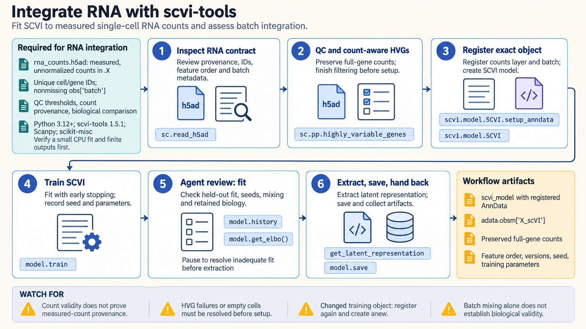

[All skill guides](README.md) / scvi-tools

# scvi-tools

**Fit probabilistic single-cell models with data requirements and biological interpretation made explicit.**

The scvi-tools skill supports generative modeling for single-cell RNA and other omics, including batch integration, annotation, multimodal analysis, and model-based differential expression. It helps an assistant choose the correct model for the modality and preserve the measurement representation it requires. Evaluation includes both technical integration and retention of biological structure.

*From single-cell measurements to reviewed probabilistic representations.
[View the full-size workflow diagram](../images/scvi-tools.png).*

## Questions this skill can help you explore

- **How can datasets be represented together?** Fit an integration model while examining batch mixing and retained biology.
- **Can existing labels help annotate cells?** Use a suitable partially supervised model and review uncertain or unsupported labels.
- **How should modalities be combined?** Choose models for RNA, proteins, accessibility, or methylation with compatible input structures.
- **What does the model imply about expression differences?** Examine posterior quantities within the model's assumptions and comparison design.

## What you bring

Provide the relevant AnnData or MuData objects, unique identifiers, feature order, sample and batch annotations, and original measurement provenance. Include quality-control decisions, known biological labels, and the intended comparison.

Input requirements differ by model: RNA counts, protein counts, accessibility, methylation coverage, and transformed values are not interchangeable. Do not reconstruct original counts by reversing a normalization or logarithmic transform.

## How the analysis works

1. **Choose the model and input contract.** Match the assay and research question to the required data representation.
2. **Prepare data before registration.** Perform justified quality control and feature selection while preserving full measurements for other analyses.
3. **Register and train.** Connect the exact data object, layers, categories, and feature order to the model.
4. **Evaluate the representation.** Inspect validation history, held-out fit, seed stability, batch mixing, and retention of known biology.
5. **Export reproducibly.** Save model-specific outputs, the model, data, feature order, environment, and training choices.

## What you get

| Output | What it helps you do |
| --- | --- |
| Latent representations | Explore integrated cell-state structure. |
| Model-based expression or modality outputs | Inspect estimates appropriate to the chosen generative model. |
| Annotation or differential-expression summaries | Review model-supported labels or comparisons. |
| Saved model and registered data context | Reproduce predictions or prepare controlled reference mapping. |

## Example request

> Use the scvi-tools skill to integrate my single-cell RNA datasets. Preserve measured counts, explain which variables are treated as batch effects, and assess both batch mixing and known cell biology. Save the model and feature order, and distinguish any posterior expression comparison from a donor-level differential-expression analysis.

*This is an illustrative modeling request, not evidence of successful biological integration.*

## Interpreting the results

**A well-mixed UMAP does not validate integration.** Removing a variable as nuisance variation can also remove the biological signal of interest, particularly when condition and batch are confounded.

Posterior differential-expression quantities are not conventional p-values, and cell-level model comparisons do not replace biological-replicate analysis. Short successful training runs establish execution rather than convergence or biological validity. Registration also depends on the exact features and encodings; changing them requires an explicit model or reference-mapping workflow.

## Get started

Use Python, scvi-tools, and model-specific dependencies in a dedicated environment. CPU training is supported; acceleration depends on the compatible PyTorch build and hardware. Local fitting needs no hosted endpoint or credentials. Installation and optional datasets or genome resources require network access.

[Setup and technical instructions](../../skills/scvi-tools/SKILL.md)
