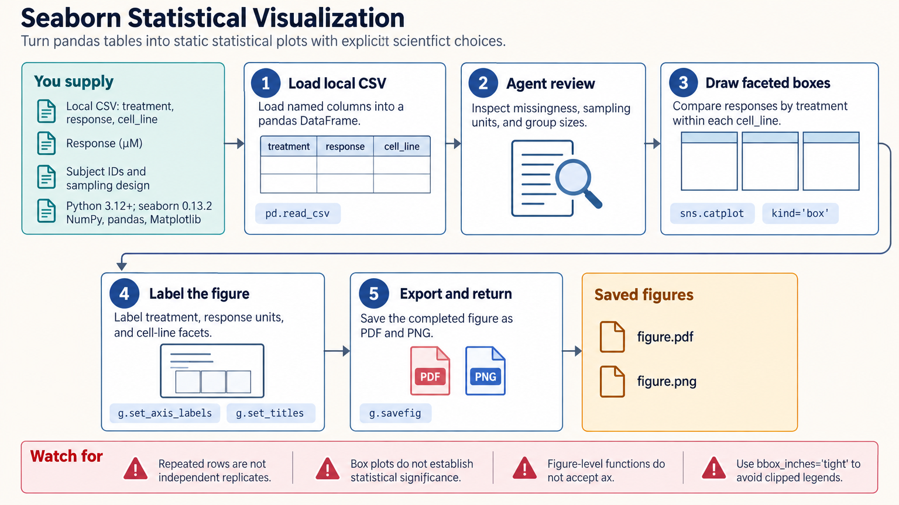

[All skill guides](README.md) / Seaborn

# Seaborn

**Explore distributions and relationships with statistical plots whose summaries are explicitly defined.**

The Seaborn skill helps an assistant create dataset-oriented plots from named variables in tables. It supports distribution, relationship, categorical, regression, matrix, and faceted views, with Matplotlib available for refinement. The guidance makes automatic aggregation, uncertainty, and missing-data behavior visible so a convenient plotting default does not silently change the scientific question.

*From a research table to interpretable exploratory plots.
[View the full-size workflow diagram](../images/seaborn.png).*

## Questions this skill can help you explore

- **What do the distributions look like?** Compare spread, skew, outliers, and group differences without relying only on averages.
- **How do variables relate?** Explore relationships, regression displays, and multivariate patterns.
- **Do patterns differ across experimental groups?** Use consistent facets and visual mappings for comparisons.
- **What exactly does an error bar represent?** Distinguish observed spread from uncertainty in an estimated quantity.

## What you bring

Provide a table with clearly named variables, units, sample identifiers, group labels, and missing-value definitions. Long-form data are usually convenient: each row represents an observation and each column a variable.

Retain subject or sample identifiers when reshaping repeated measurements. State whether the goal is individual trajectories, a group summary, an estimated relationship, or a descriptive distribution.

## How it works

1. **Prepare the table.** Check types, categories, identifiers, missingness, and the independent sampling unit.
2. **Choose the plot and mappings.** Assign position, color, size, style, and facets according to variable meaning.
3. **Specify statistical behavior.** Set the estimator, interval type, weighting, and whether individual observations should remain separate.
4. **Refine the display.** Adjust labels, scales, category order, palettes, and panel layout while preserving comparable conventions.
5. **Inspect and export.** Check missing-data gaps, repeated-measure handling, legends, and readability in the saved figure.

## What you get

| Output | What it helps you do |
| --- | --- |
| Distribution and relationship plots | Explore raw patterns and possible modeling needs. |
| Faceted or multivariate views | Compare groups with a consistent visual structure. |
| Explicit statistical summaries | Understand how plotted estimates and intervals were calculated. |
| Saved figures | Share a reviewed exploratory view or refine it for a report. |

## Example request

> Use the Seaborn skill to explore my repeated-measure experiment. Show individual subject trajectories and a separate summary of within-subject change. State what every interval represents, preserve meaningful gaps in observation, and use consistent scales and labels across treatment groups.

*This is an illustrative plotting request, not a statistical conclusion.*

## Interpreting the results

**A plotting function may aggregate data automatically.** Default means and bootstrap intervals may not match the estimand or dependence structure. A fixed random seed makes a bootstrap repeatable but does not correct pseudoreplication.

Separate time-point intervals are not an interval for paired change. Lines can connect across missing observations unless gaps are handled deliberately. Density smoothing, category spacing, and weighting also affect interpretation; weighted plots do not implement arbitrary survey-design inference.

## Get started

Use Python, Seaborn, pandas, NumPy, and Matplotlib; some methods need additional statistical packages. Local plotting needs no credentials. Installation and uncached example-dataset downloads require network access; private or offline work should load local tables explicitly.

[Setup and technical instructions](../../skills/seaborn/SKILL.md)
