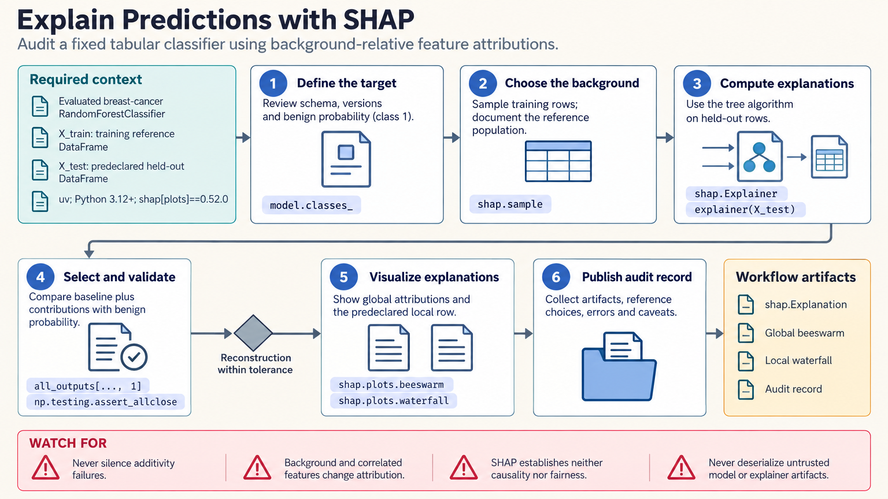

[All skill guides](README.md) / SHAP

# SHAP

**Describe how a fitted model assigns a prediction across its input features.**

The SHAP skill guides feature-attribution analysis for an already fitted predictive model. It helps select an explainer and reference population, define the output being explained, validate attribution sums, and produce local or global visualizations. The resulting explanations describe model behavior under a particular comparison, rather than establishing a scientific mechanism.

*From an evaluated predictive model to checked feature-attribution summaries.
[View the full-size workflow diagram](../images/shap.png).*

## Questions this skill can help you explore

- **Which features contribute to this prediction?** Explain an individual output relative to a specified baseline.
- **What patterns does the model use across cases?** Summarize feature attributions over a declared analysis population.
- **How do explanations depend on the reference?** Examine the role of background data, masking, and correlated inputs.
- **Are the explanations on the intended scale?** Distinguish regression values, raw classifier margins, probabilities, or other outputs.

## What you bring

Provide a trusted fitted model, its preprocessing pipeline, held-out or clearly labeled analysis rows, and an appropriate training or reference population. Include feature names, ordering, units, and model-library versions.

Specify the exact output to explain, including its class or index for a multi-output model. The same classifier can produce attributions on different scales depending on the callable and explainer configuration.

## How the analysis works

1. **Define the explanation target.** Record the model, preprocessing, rows, output method, units, and reference population.
2. **Choose the explainer and masker.** Match them to the model and the meaning of a feature being withheld or replaced.
3. **Compute attributions.** Retain output indices, baseline values, feature order, and computational settings.
4. **Validate the reconstruction.** Check that the baseline plus contributions matches the exact output being explained.
5. **Visualize and interpret.** Select local or aggregate plots that answer the question and report sensitivity and limitations.

## What you get

| Output | What it helps you do |
| --- | --- |
| Per-case feature attributions | Inspect a prediction relative to its defined baseline. |
| Global attribution summaries | Explore patterns of model reliance across selected rows. |
| Additivity checks | Detect mismatches in output space, ordering, or preprocessing. |
| Explanation configuration record | Reproduce the background and masking choices. |

## Example request

> Use the SHAP skill to explain my evaluated classifier on held-out samples. Explain the positive-class probability, choose background data from the training population, and verify that the attributions reconstruct the model output. Show a few individual cases and an aggregate view, with the role of correlated features made explicit.

*This is an illustrative explanation request, not evidence of a causal feature effect.*

## Interpreting the results

**SHAP explains a model, not the underlying scientific system.** Attribution does not establish causality, fairness, recourse, or mechanism. It also does not replace predictive validation.

The reference population and masking rule change the comparison being made. Correlated features can share or redistribute apparent contribution, and explanations from different output scales are not directly interchangeable. An additivity failure should be investigated rather than hidden, because it can reveal a mismatch in shapes, preprocessing, or model versions.

## Get started

Use the documented Python and SHAP environment, plus the fitted model's own library and optional plotting dependencies. Local explanation needs no service credentials. Installation and optional pretrained resources require network access; model artifacts should come from a trusted source.

[Setup and technical instructions](../../skills/shap/SKILL.md)
