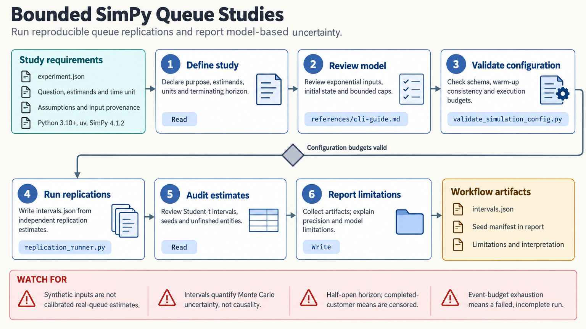

[All skill guides](README.md) / SimPy

# SimPy

**Explore event-driven systems with explicit queues, resources, assumptions, and simulation uncertainty.**

The SimPy skill helps build process-based discrete-event simulations for systems in which entities wait, compete for resources, and trigger events. Examples include laboratory queues, service operations, production processes, and logistics. It guides both model implementation and the checks needed to interpret simulation outputs as a study of a defined system.

*From a conceptual process model to reproducible simulation experiments.
[View the full-size workflow diagram](../images/simpy.png).*

## Questions this skill can help you explore

- **Where do queues and bottlenecks arise?** Represent resource capacity, routing, service times, priorities, and interruptions.
- **How do alternative configurations compare?** Simulate specified scenarios under controlled assumptions and random streams.
- **How precise are the estimated outputs?** Use independent replications and examine warm-up, run length, and unfinished entities.
- **Does the implementation match the intended process?** Inspect traces, conservation checks, and simple known cases.

## What you bring

Provide the system boundary, entities, resources, event rules, initial conditions, time units, and desired outputs. Include evidence for arrival, service, failure, or other input distributions.

State whether the study concerns a terminating process or long-run operation. Specify scenario choices, stopping rules, resource limits, and the system observations or expert knowledge available for validation.

## How the analysis works

1. **Write the conceptual model.** Define assumptions, omitted mechanisms, routing, capacities, and the quantities to estimate.
2. **Implement bounded processes.** Represent event-driven behavior and set time, event, entity, and replication limits.
3. **Instrument and verify.** Observe the right state transitions and test edge cases, queue discipline, conservation, and event ordering.
4. **Validate for the purpose.** Compare model behavior with analytical benchmarks, real observations, or expert evidence where available.
5. **Run and summarize replications.** Use separate random streams and report precision, sensitivity, initialization, and incomplete work at the horizon.

## What you get

| Output | What it helps you do |
| --- | --- |
| Explicit simulation model | Review how the process and resource constraints are represented. |
| Event traces and checks | Diagnose implementation errors and unexpected behavior. |
| Queue and performance summaries | Compare waiting, throughput, utilization, or other defined outcomes. |
| Replication and sensitivity reports | Assess numerical precision and dependence on assumptions. |

## Example request

> Use the SimPy skill to model a laboratory sample-processing queue. I will provide arrival patterns, equipment capacity, and processing-time data. Define the assumptions, verify simple cases, compare two capacity scenarios with independent replications, and report waiting times together with uncertainty and unfinished samples.

*This is an illustrative simulation request, not a demonstrated operational improvement.*

## Interpreting the results

**SimPy supplies a scheduler, not a validated model of the system.** Input distributions, warm-up, run length, and omitted mechanisms need scientific justification.

Entities within one run are often correlated, so treating them as independent replications can understate uncertainty. Time-weighted statistics and horizon censoring also need careful handling. A scenario difference is conditional on the simulated assumptions; it does not by itself establish a causal effect in the real system.

## Get started

The bounded helpers use Python, SimPy, and the standard library. They operate locally without network calls or credentials. Installation needs access to the required package; study-specific input estimation and validation remain part of the research work.

[Setup and technical instructions](../../skills/simpy/SKILL.md)
