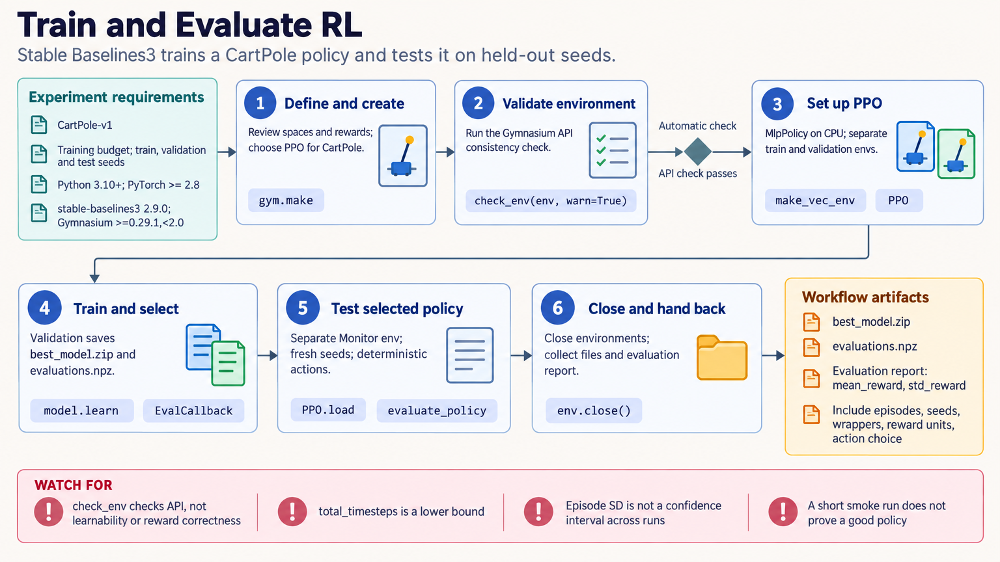

[All skill guides](README.md) / Stable Baselines3

# Stable Baselines3

**Train and evaluate reinforcement-learning policies in a clearly defined simulated environment.**

The Stable Baselines3 skill supports single-agent reinforcement-learning experiments using algorithms such as PPO, SAC, and DQN. It helps define a Gymnasium environment, validate its interface, configure training, preserve checkpoints and normalization, and evaluate complete episodes. The focus is a reproducible experiment whose reward and environment meaning remain explicit.

*From a simulated decision problem to a reviewed policy-training experiment.
[View the full-size workflow diagram](../images/stable-baselines3.png).*

## Questions this skill can help you explore

- **Can a policy learn the proposed task?** Match an algorithm to discrete or continuous actions and the available observations.
- **Is the custom environment behaving as intended?** Check observation and action spaces, resets, rewards, and episode endings.
- **How stable is training?** Compare independent training seeds and review learning curves and evaluation behavior.
- **Can a saved policy be evaluated consistently?** Restore the matching preprocessing and normalization state.

## What you bring

Provide the environment or simulator, observation and action definitions, reward function, termination rules, and time limits. Explain the scientific objective represented by the reward and any constraints not captured by it.

Specify training resources, evaluation scenarios, baseline policies, and the distinction between true termination and time-limit truncation. Keep eventual real-world deployment separate from the simulated study.

## How it works

1. **Define the decision problem.** Establish state information, permitted actions, reward meaning, and episode boundaries.
2. **Validate the environment.** Check interface compatibility and simple behavior before committing a large training budget.
3. **Configure training.** Choose a suitable algorithm, wrappers, vectorized environments, monitoring, checkpoints, and seeds.
4. **Preserve all required state.** Save the model and matching normalization statistics; retain other state needed for the intended resumption.
5. **Evaluate independently.** Freeze normalization, report rewards in the intended units, use complete episodes, and compare separately trained seeds.

## What you get

| Output | What it helps you do |
| --- | --- |
| Validated environment configuration | Review the decision problem exposed to the policy. |
| Trained policy checkpoints | Resume or inspect the learned behavior. |
| Training and evaluation records | Track learning and select a checkpoint transparently. |
| Episode summaries or bounded recordings | Examine performance and failure modes in held-out scenarios. |

## Example request

> Use the Stable Baselines3 skill to train a policy in my simulator. First validate observations, actions, rewards, and episode endings. Compare independent training seeds against a simple baseline, preserve normalization with each checkpoint, and evaluate on separate scenarios with reward units and failure cases reported clearly.

*This is an illustrative simulated-learning request, not evidence of a deployable policy.*

## Interpreting the results

**High reward only establishes success under the implemented reward and environment.** A policy may exploit simulator behavior or ignore important scientific constraints that were never encoded.

Variation across evaluation episodes is different from uncertainty across independently trained policies. Normalization learned on evaluation data contaminates the comparison, and short smoke runs establish mechanics rather than policy quality. A saved model alone may omit replay-buffer or other state needed for exact training continuation.

## Get started

Use Python, compatible PyTorch, Stable Baselines3, and Gymnasium. Local training needs no service credentials after installation. Some environments, logging tools, and contributed algorithms require separate packages; accelerator use depends on the available hardware and software stack.

[Setup and technical instructions](../../skills/stable-baselines3/SKILL.md)
