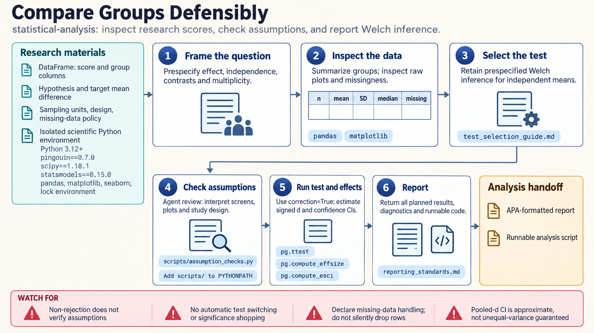

[All skill guides](README.md) / Statistical analysis

# Statistical analysis

**Choose and report an analysis around the study design, effect of interest, and uncertainty.**

The statistical-analysis skill guides common research comparisons, regression, correlation, assumption review, effect sizes, and Bayesian alternatives. It helps an assistant connect the scientific question to a suitable analysis and explain the result in clear terms. The workflow gives effect estimates and their uncertainty a central role rather than treating a p-value as the whole answer.

*From a research question and study design to a transparent statistical result.
[View the full-size workflow diagram](../images/statistical-analysis.png).*

## Questions this skill can help you explore

- **What analysis matches this comparison?** Distinguish independent groups, paired observations, repeated measures, and other dependence structures.
- **How large and uncertain is the effect?** Report estimates and intervals alongside appropriate tests.
- **Which assumptions matter?** Review diagnostics in the context of the design and the quantity being estimated.
- **How should the result be written?** Prepare a clear account of descriptives, methods, uncertainty, and limitations.

## What you bring

Provide the data, variable definitions and units, study design, independent sampling unit, planned contrasts, exclusions, and missingness information. State the hypothesis and effect of interest before outcome-driven method choices.

Include pairing or clustering identifiers, any analysis plan, and the family of comparisons relevant to multiplicity. Identify exploratory changes separately from prespecified analyses.

## How the analysis works

1. **Frame the question.** Specify the target effect, comparison, sampling units, dependence, and interpretation sought.
2. **Inspect the observations.** Review sample sizes, distributions, missing values, outliers, and relevant raw-data plots.
3. **Choose a justified method.** Match the statistical model to the design and estimand rather than selecting a test from one diagnostic p-value.
4. **Estimate and examine sensitivity.** Calculate effects and uncertainty, inspect assumptions, and document justified alternative analyses.
5. **Report completely.** Present descriptive statistics, methods, estimates, intervals, tests where relevant, and departures from the original plan.

## What you get

| Output | What it helps you do |
| --- | --- |
| Analysis rationale | Understand why the method fits the scientific question. |
| Descriptive and diagnostic summaries | Review the data and model limitations. |
| Effect estimates and uncertainty | Assess magnitude and precision rather than significance alone. |
| Structured research reporting | Communicate the analysis with explicit assumptions and caveats. |

## Example request

> Use the statistical-analysis skill to compare my paired experimental measurements. Check the identifiers and missing pairs, define the effect as within-specimen change, inspect the distribution of those changes, and report an effect estimate with uncertainty. Explain the assumptions and distinguish planned analyses from any exploratory follow-up.

*This is an illustrative analysis request, not a significant result.*

## Interpreting the results

**A diagnostic screen cannot certify assumptions or scientific validity.** Study design and dependence often matter more than whether a normality test crosses a threshold. Rank-based tests also answer different questions from tests of means.

A p-value does not measure effect size, practical importance, or the probability that a hypothesis is true. Nonsignificance is not equivalence, and observed power should not be used to interpret a null finding. Bayesian results likewise depend on explicit model and prior choices.

## Get started

The documented isolated Python environment includes statistical and scientific packages such as SciPy, Pingouin, statsmodels, PyMC, and ArviZ. Local analyses need no credentials. Network access is required for installation and optional documentation review, not for processing supplied local data.

[Setup and technical instructions](../../skills/statistical-analysis/SKILL.md)
