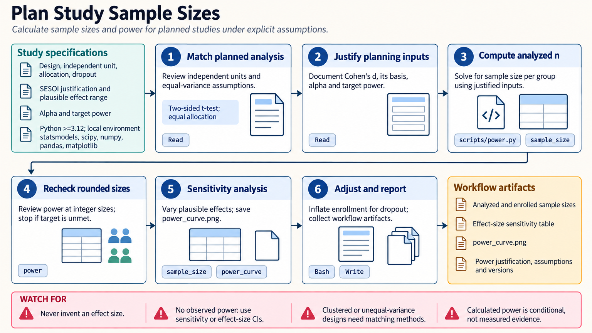

[All skill guides](README.md) / Statistical power and sample size

# Statistical power and sample size

**Plan independent sample numbers around a meaningful effect and a defensible analysis.**

The statistical-power skill helps calculate sample size, power, minimum detectable effects, and power curves for research planning. It supports analytical calculations for suitable standard designs and simulation-based work when the planned model is more complex. The emphasis is on transparent assumptions and sensitivity ranges rather than a single apparently definitive sample number.

*From a planned scientific comparison to an explicit sample-size justification.
[View the full-size workflow diagram](../images/statistical-power.png).*

## Questions this skill can help you explore

- **How many independent units are needed?** Calculate the analyzed sample size for a specified effect, test, significance level, and target power.
- **What can a feasible study detect?** Estimate the minimum detectable effect over plausible assumptions.
- **How sensitive is the plan?** Explore uncertainty in effect size, variance, allocation, or correlation.
- **Does a complex design need simulation?** Match the planned analysis for clustered, longitudinal, count, or survival outcomes.

## What you bring

Provide the planned study design, independent experimental unit, outcome, primary comparison, intended statistical analysis, and a scientifically important effect. Include variance or baseline-rate assumptions and their sources.

State allocation, clustering, repeated measurements, attrition, multiplicity, and practical recruitment limits. Pilot estimates should be treated cautiously, particularly when small samples may exaggerate the apparent effect.

## How the analysis works

1. **Define the inferential goal.** Establish whether the study seeks a superiority test or needs a different framework such as precision or equivalence planning.
2. **Justify effect and nuisance assumptions.** Record a meaningful target effect and plausible ranges for variance, rates, or dependence.
3. **Choose the calculation.** Use an analytical method that matches the planned test or a credible simulation of the complete analysis.
4. **Explore sensitivity.** Produce power curves across sample sizes and assumptions rather than relying on one scenario.
5. **Translate into a study plan.** Distinguish analyzed from enrolled samples and account for attrition, allocation, clustering, and multiple comparisons.

## What you get

| Output | What it helps you do |
| --- | --- |
| Sample-size or detectable-effect estimates | Relate study feasibility to a defined scientific target. |
| Power curves and sensitivity scenarios | Show how conclusions change under uncertain assumptions. |
| Simulation records where needed | Reproduce the proposed data-generating and analysis process. |
| Written planning justification | Document design, effect sources, adjustments, and limitations. |

## Example request

> Use the statistical-power skill to plan my paired study. I will provide a meaningful within-person effect, plausible variability and correlation, and expected attrition. Match the calculation to the planned analysis, show sensitivity curves, and distinguish the number of completed participants from the number to recruit.

*This is an illustrative planning request, not a sample-size recommendation for an actual study.*

## Interpreting the results

**Power is conditional on the assumed alternative and analysis.** An optimistic effect or incorrect dependence model can make a precise calculation misleading. More measurements within one subject do not create more independent subjects.

Observed power calculated after seeing a result is not a useful explanation of nonsignificance. Simulation also needs credible data generation and a calibrated analysis; repeating an incorrect model many times does not repair it. Precision, equivalence, noninferiority, and sequential monitoring require their own planning methods.

## Get started

Local calculations use Python with statsmodels, SciPy, NumPy, pandas, and Matplotlib. Optional comparison or survival extensions need additional packages. No credentials are required; installation needs network access unless packages are already available.

[Setup and technical instructions](../../skills/statistical-power/SKILL.md)
