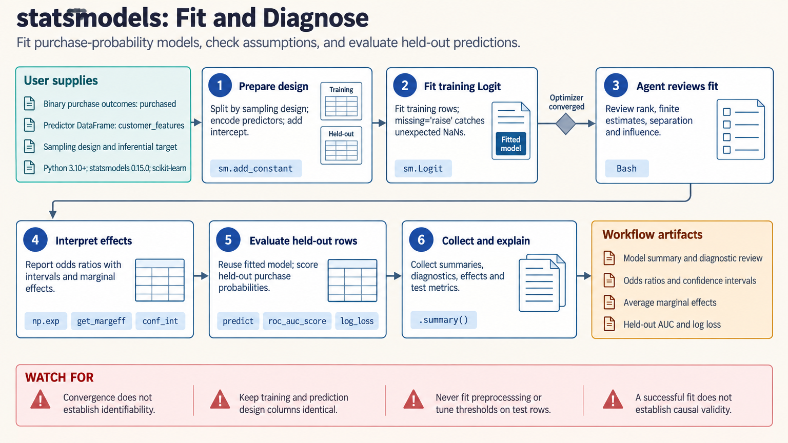

[All skill guides](README.md) / Statsmodels

# Statsmodels

**Fit statistical models with interpretable effects, diagnostics, and explicit uncertainty assumptions.**

The Statsmodels skill supports regression, generalized linear and discrete models, mixed models, and time-series analysis in Python. It helps an assistant build a design matrix, fit a suitable model, inspect diagnostics, and report coefficients, marginal effects, or forecasts. The workflow connects numerical output to the study design that gives it meaning.

*From a study design and data table to a checked statistical model.
[View the full-size workflow diagram](../images/statsmodels.png).*

## Questions this skill can help you explore

- **How is an outcome associated with measured predictors?** Fit models suited to continuous, binary, count, ordinal, or other supported outcomes.
- **Which observations or assumptions drive the result?** Inspect residuals, influence, heteroskedasticity, dependence, and model specification.
- **How should effect estimates be reported?** Distinguish coefficients, transformed quantities, marginal effects, and uncertainty.
- **What does a time-series model predict?** Fit supported temporal models and assess forecasts against held-out observations.

## What you bring

Provide the outcome and predictor table, units, categorical levels, independent sampling unit, missingness, and study design. Include clustering, repeated observations, offsets, weights, or time structure where relevant.

State the target effect or forecast horizon and whether inference is descriptive, predictive, or intended to be causal. Causal interpretation needs design and identification assumptions beyond the statistical fitting function.

## How the analysis works

1. **Define the model and target.** Choose an outcome distribution, link or temporal structure, predictors, and contrasts suited to the question.
2. **Validate the design.** Check intercept handling, category coding, missing rows, identifiability, units, and comparable analysis sets.
3. **Fit and diagnose.** Review convergence, residual patterns, influence, and variance or dependence assumptions.
4. **Evaluate alternatives appropriately.** Use compatible likelihood comparisons, justified uncertainty methods, and held-out prediction checks where relevant.
5. **Report the result.** Present estimates and intervals alongside assumptions, retained observations, transformations, and limitations.

## What you get

| Output | What it helps you do |
| --- | --- |
| Fitted model and coefficient summaries | Inspect estimated relationships under the specified model. |
| Diagnostics and influence measures | Identify patterns or observations needing scientific review. |
| Marginal effects or predictions | Express model results on a scale relevant to the question. |
| Forecasts or comparison tables | Assess temporal predictions or justified alternative specifications. |

## Example request

> Use the Statsmodels skill to model my count outcome with a documented exposure offset. Review the predictor coding, missing observations, and evidence for overdispersion. Report interpretable effects with uncertainty, inspect influential cases, and explain which conclusions depend on the observational design.

*This is an illustrative modeling request, not an estimated effect.*

## Interpreting the results

**A successful fit establishes execution, not causal identification or model adequacy.** Robust standard errors do not repair every source of bias, and omitted variables or incorrect dependence can still undermine interpretation.

Model-comparison statistics require compatible likelihoods, outcomes, and observations. Dropping different rows across models can change the comparison itself. Forecast evaluation must respect time, and parameter uncertainty should not be confused with the wider uncertainty of an individual future observation.

## Get started

Use Python and Statsmodels with its numerical dependencies in the documented environment. Plotting and predictive metrics may need Matplotlib and scikit-learn. Local fitting needs no credentials or external service; network access is used for installation or documentation.

[Setup and technical instructions](../../skills/statsmodels/SKILL.md)
