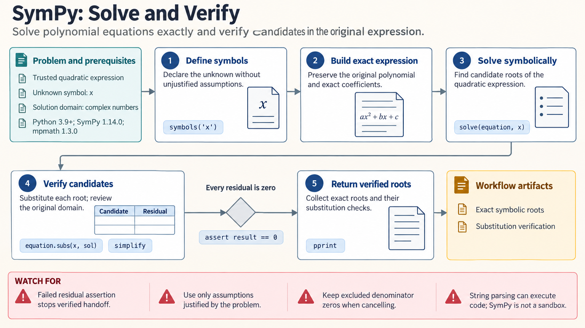

[All skill guides](README.md) / SymPy

# SymPy

**Derive and verify mathematical expressions while keeping domains and assumptions explicit.**

The SymPy skill supports exact symbolic algebra, calculus, equation solving, linear algebra, physics expressions, and code or LaTeX generation. It helps an assistant retain mathematical structure before numerical evaluation. This is useful when a scientific derivation needs to be checked, simplified, documented, or converted into a reusable numerical function.

*From a scientific equation to a checked symbolic derivation.
[View the full-size workflow diagram](../images/sympy.png).*

## Questions this skill can help you explore

- **Can this relationship be derived exactly?** Manipulate equations, differentiate, integrate, or expand a model symbolically.
- **Which solutions belong to the physical domain?** Solve under explicit real, positive, integer, or other justified assumptions.
- **How do parameters enter a result?** Obtain symbolic sensitivities, matrix expressions, or limiting behavior.
- **Can the derivation become usable code or documentation?** Export a checked expression for numerical evaluation or mathematical typesetting.

## What you bring

Provide the equations, definitions of every symbol, units, domains, constraints, and the quantity to derive. State initial or boundary conditions for differential equations and identify any parameter values that require separate cases.

Clarify whether inputs are exact quantities or measured approximations. When a mathematical expression comes from an external file or user interface, distinguish trusted expressions from untrusted text before parsing.

## How the analysis works

1. **Define symbols and assumptions.** Encode only the restrictions justified by the problem and record the intended domain.
2. **Preserve exact arithmetic.** Keep rational and symbolic quantities exact when approximation would obscure the derivation.
3. **Perform the calculation.** Use appropriate algebraic, calculus, equation-solving, or matrix operations.
4. **Verify the result.** Substitute candidate solutions into the original equations, check excluded points and branches, and inspect relevant limits.
5. **Prepare the handoff.** Export readable mathematics or a numerical function, then compare representative numerical evaluations where appropriate.

## What you get

| Output | What it helps you do |
| --- | --- |
| Exact expressions and derivations | Review mathematical relationships without premature rounding. |
| Solution sets with conditions | Understand which roots or branches satisfy the problem. |
| Derivatives, series, or matrix results | Investigate sensitivity, approximations, or structural properties. |
| LaTeX or generated numerical functions | Incorporate checked mathematics into reports or computation. |

## Example request

> Use the SymPy skill to derive a steady-state expression from my equations. Define the physically allowed parameter domain, keep exact arithmetic, and verify every candidate in the original system. Explain excluded denominator zeros and limiting cases, then prepare a numerical form for comparison with my simulation.

*This is an illustrative derivation request, not a solution to a supplied model.*

## Interpreting the results

**Symbolic simplification depends on assumptions and branches.** An unconstrained symbol may be complex, and familiar square-root or logarithm identities do not hold universally. Cancelling a factor can hide a point where the original expression was undefined.

A solver may return a conditional or incomplete representation rather than a single elementary formula. Unknown assumptions must remain unknown. Exact mathematics also does not establish that the scientific model is appropriate, and generated numerical code needs its own checks for scale and stability.

## Get started

Core work uses Python and SymPy with compatible dependencies. Numerical integration, plotting, interactive notebooks, parsing extensions, or compiled wrappers may require additional packages or compilers. Local symbolic calculations need no credentials or network after installation.

[Setup and technical instructions](../../skills/sympy/SKILL.md)
