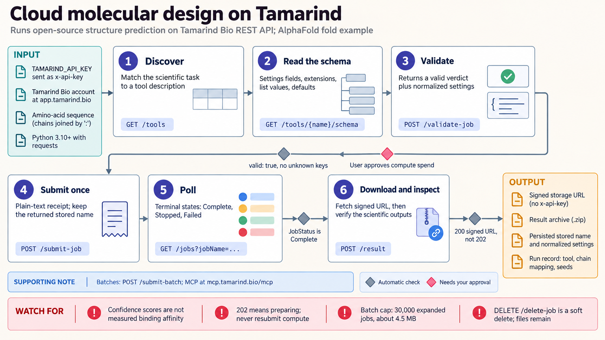

[All skill guides](README.md) / Tamarind Bio

# Tamarind Bio

**Run selected structural-biology and molecular-design tools on managed compute with traceable job settings.**

The Tamarind Bio skill helps an assistant discover hosted tools, inspect their input schemas, validate job settings, submit work, and retrieve results. The catalog includes structure prediction, protein design, docking, molecular dynamics, and related workflows. Its role is to manage a scientifically specified calculation and preserve the context needed to interpret its outputs.

*From a selected molecular-modeling task to inspected hosted results.
[View the full-size workflow diagram](../images/tamarind.png).*

## Questions this skill can help you explore

- **Which hosted tool matches the inputs and question?** Compare task descriptions and required structures, sequences, or settings.
- **Are job settings accepted as intended?** Inspect normalized inputs and unrecognized fields before submission.
- **How can batches or linked jobs stay organized?** Preserve names, settings, file references, and job status across a campaign.
- **What do model outputs actually support?** Review structural confidence, interfaces, clashes, and chemical assumptions without equating them to experiments.

## What you bring

Provide the scientific objective, selected tool if already known, input sequences or structures, identifiers, chain mapping, and required constraints. Include ligand chemistry and stereochemistry when relevant.

Specify account access, project organization, batch size, budget, and the desired result files. Some tools require a receptor, search box, template, alignment, or other information that cannot be replaced by choosing a superficially similar method.

## How it works

1. **Discover and select.** Inspect the available tool and confirm that its modeling assumptions and outputs match the task.
2. **Read the input schema.** Check required and conditional fields, file formats, defaults, and account-specific availability.
3. **Validate before submission.** Review normalized settings and resolve unrecognized parameters that could leave unintended defaults active.
4. **Submit and track once.** Preserve the stored job identity, monitor the correct terminal states, and handle failures without duplicate submissions.
5. **Retrieve and inspect.** Download outputs and record the model, input provenance, settings, seeds, and scientific limitations.

## What you get

| Output | What it helps you do |
| --- | --- |
| Tool and settings specification | Review exactly which hosted method is being requested. |
| Job and batch records | Trace progress, failures, and resource use. |
| Model-specific result files | Inspect structures, sequences, poses, or other requested outputs. |
| Interpretation notes | Separate computational confidence from experimental support. |

## Example request

> Use the Tamarind skill to prepare a hosted structure-prediction job for my supplied sequence and chosen tool. Inspect the actual schema, preserve chain identifiers and alignment settings, validate the submission, and retrieve the result files with the job record. Explain what the confidence measures can and cannot establish.

*This is an illustrative hosted-workflow request, not a verified structure prediction.*

## Interpreting the results

**Model confidence does not establish binding, specificity, affinity, or experimental validity.** Docking scores are not interchangeable with measured binding free energies, and designed structures or sequences require independent validation.

Accepted input fields do not guarantee queue access, account entitlement, or successful execution. Tool catalogs and optional settings can differ, so the chosen schema and submitted configuration matter. The checked-in examples are illustrative for authenticated jobs rather than proof that every account workflow was executed.

## Get started

The REST workflow uses Python, requests, network access, a Tamarind Bio account, and `TAMARIND_API_KEY`. A compatible host can alternatively use the platform's MCP interface. Hosted computation and input transmission should match the approved project scope and account budget.

[Setup and technical instructions](../../skills/tamarind/SKILL.md)
