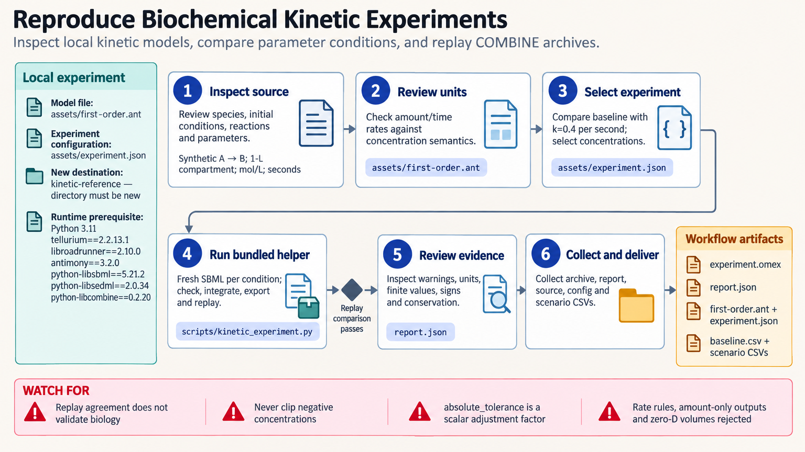

[All skill guides](README.md) / Tellurium

# Tellurium

**Simulate biochemical reaction networks and preserve the exact model and experiment for replay.**

The Tellurium skill supports deterministic biochemical time courses from local SBML or Antimony models. It helps an assistant inspect units and reaction semantics, compare independent parameter conditions, and export a reproducible simulation experiment. The workflow includes replay of a COMBINE archive so the handoff contains more than a notebook's transient state.

*Simulate biochemical time courses and package the exact models and experiment for reproducible replay. [View the full-size workflow diagram](../images/tellurium.png).*

## Questions this skill can help you explore

- **What time course follows from this kinetic model?** Simulate selected concentrations under explicit initial conditions and parameters.
- **How does a parameter change affect the trajectory?** Compare independent conditions initialized from the same source model.
- **Are units and species meanings consistent?** Review amount-versus-concentration semantics, compartment definitions, and validation warnings.
- **Can someone reproduce the experiment?** Save exact scenario models and the simulation specification, then compare replayed outputs.

## What you bring

Provide a local SBML or Antimony model, its scientific source, parameter provenance, and the biological question. Include compartments, initial conditions, boundary species, reactions, and any rules or events.

Specify the time interval, output species, intended parameter perturbations, and units as defined by the model. Distinguish a kinetic reaction-network model from a steady-state constraint-based metabolic reconstruction.

## How the analysis works

1. **Inspect the model.** Review species, reactions, parameters, initial conditions, and whether the helper supports the model's constructs.
2. **Check semantics and units.** Retain consistency warnings and distinguish concentrations from amounts rather than assuming unspecified units are SI.
3. **Define independent experiments.** Select supported concentration outputs and constant-global-parameter changes with explicit simulation settings.
4. **Simulate and review.** Run each condition from a fresh model, examine numerical behavior, and preserve the exact scenario definition.
5. **Export and replay.** Package SBML models and SED-ML instructions in a COMBINE archive and compare replayed trajectories with the original run.

## What you get

| Output | What it helps you do |
| --- | --- |
| Scenario concentration tables | Compare modeled time courses under defined conditions. |
| Exact SBML files | Recover the model actually used for each scenario. |
| SED-ML and COMBINE archive | Share a structured simulation experiment. |
| Validation and replay report | Inspect units, numerical settings, warnings, and reproduction differences. |

## Example request

> Use the Tellurium skill to simulate my supplied biochemical model under baseline and two parameter conditions. Check species and reaction units, start each condition independently, and save concentration trajectories. Export the exact models and experiment as a COMBINE archive, replay it, and report any differences or unsupported constructs.

*This is an illustrative simulation request, not evidence that a biochemical mechanism is correct.*

## Interpreting the results

**A reproducible trajectory does not establish experimental calibration.** Literature parameters and example models may not describe the biological system or conditions being investigated.

SBML consistency checks and successful archive replay address specific technical properties, not every aspect of physical validity or simulator portability. Amount and concentration semantics matter, particularly when compartment volume changes. The bounded helper deliberately rejects some model constructs, and its solver tolerance setting is not a universal concentration-error guarantee.

## Get started

The documented environment uses Python, Tellurium, libRoadRunner, Antimony, and SBML, SED-ML, and COMBINE libraries. Local simulation and replay need no credentials or external service. Installation requires compatible native packages and network access unless cached.

[Setup and technical instructions](../../skills/tellurium/SKILL.md)
