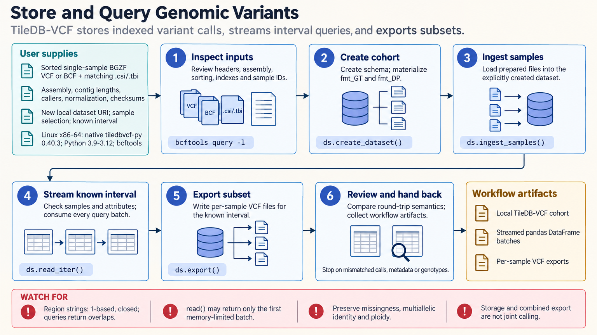

[All skill guides](README.md) / TileDB-VCF

# TileDB-VCF

**Store and query cohort variant calls while preserving genomic conventions and complete query results.**

The TileDB-VCF skill supports ingestion of indexed single-sample variant files into a cohort store, incremental sample additions, interval queries, statistics, and subset export. It helps an assistant manage data access without confusing storage behavior with variant calling or population inference. Local and cloud workflows have separate runtime and access requirements.

*From indexed variant files to a traceable cohort query workflow.
[View the full-size workflow diagram](../images/tiledbvcf.png).*

## Questions this skill can help you explore

- **How can a growing cohort be queried efficiently?** Add compatible samples and select regions, samples, and attributes for a defined workload.
- **Which records overlap an interval?** Retrieve variants with the correct assembly and coordinate conventions.
- **Did the query return everything requested?** Continue memory-bounded batches until the result is complete.
- **What do stored cohort statistics summarize?** Review allele and quality-control quantities under their actual denominator and sample scope.

## What you bring

Provide coordinate-sorted, indexed single-sample VCF or BCF files and their checksums. Include reference assembly, contig names and lengths, calling and normalization history, compatible headers, and the sample identities stored inside the files.

Specify expected cohort growth, common query regions and attributes, local storage or cloud destination, and resource limits. Filenames alone do not establish sample identity or assembly compatibility.

## How it works

1. **Validate input conventions.** Check sample counts, indexes, assembly, contigs, headers, and representation policies.
2. **Create the dataset explicitly.** Plan schema and frequently queried fields before ingesting the cohort.
3. **Verify a small known case.** Inspect an interval and round-trip export before scaling to more data.
4. **Query completely.** Use the appropriate coordinate surface and consume all streaming batches within the available memory.
5. **Export and interpret.** Preserve query settings and check statistics against the actual cohort, ploidy, missingness, and callable-region policies.

## What you get

| Output | What it helps you do |
| --- | --- |
| Cohort variant store | Organize compatible single-sample calls for repeated queries. |
| Sample and region subsets | Prepare focused downstream genomic analyses. |
| Streamed tables or exports | Retrieve complete results without assuming they fit in memory. |
| Cohort statistics and QC | Inspect stored-call summaries with documented scope. |

## Example request

> Use the TileDB-VCF skill to plan a local store for my indexed single-sample variant files. Confirm assembly and header compatibility, validate a small interval and export, and prepare a streaming query for selected samples. Explain whether reported allele frequencies describe the full cohort or my selected subset.

*This is an illustrative data-management request, not a genetic association result.*

## Interpreting the results

**A missing variant record is not proof of a homozygous-reference genotype.** Allele denominators depend on called alleles, ploidy, missingness, and reference-block policy.

Queries return overlapping records, and coordinate conventions differ between region strings, BED, returned fields, and statistics. Cohort allele frequencies may remain cohort-wide even when a query selects samples. Storage and QC do not perform joint calling, normalization, association testing, or population-structure adjustment, and do not establish analysis readiness.

## Get started

Use a native TileDB-VCF installation and a compatible Python environment; the general TileDB Python package is not a substitute. Input compression and indexing may use bcftools. Local access needs no service credentials. Cloud work additionally requires its client, account token, network, and storage permissions.

[Setup and technical instructions](../../skills/tiledbvcf/SKILL.md)
