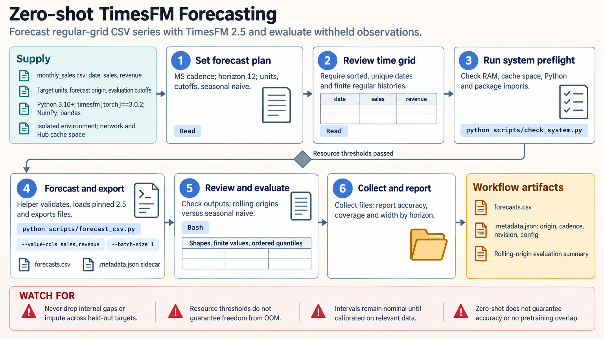

[All skill guides](README.md) / TimesFM forecasting

# TimesFM forecasting

**Evaluate pretrained time-series forecasts against the cadence, horizon, and uncertainty your data require.**

The TimesFM forecasting skill uses pretrained models to forecast temporal measurements without task-specific model training. It covers regular-grid preparation, point and quantile outputs, supported covariates, and held-out evaluation. The workflow separates package versions from checkpoint versions and makes checkpoint terms, resource needs, and evaluation assumptions explicit.

*From an ordered measurement series to evaluated point and quantile forecasts.
[View the full-size workflow diagram](../images/timesfm-forecasting.png).*

## Questions this skill can help you explore

- **What does a pretrained model predict beyond the observed history?** Forecast a defined horizon at the original measurement cadence.
- **How does it compare with a simple baseline?** Evaluate against naive or seasonal-naive forecasts across held-out origins.
- **Are forecast intervals useful in this domain?** Examine empirical coverage and width by horizon rather than assuming calibration.
- **Can known future information help?** Use supported covariates only when their values are available at the forecast origin.

## What you bring

Provide time-stamped measurements, units, cadence, series identifiers, missing-value definitions, forecast horizon, and evaluation cutoffs. Explain irregular observations, structural breaks, and any covariates.

Identify which future covariate values would actually be known when issuing a forecast. Specify the checkpoint use case and available memory and cache space before downloading model weights.

## How the analysis works

1. **Define the forecast task.** Fix cadence, origin, horizon, units, covariate availability, and baseline comparisons.
2. **Validate the time grid.** Check sorting, duplicates, regular spacing, and missing values without collapsing internal gaps.
3. **Select and record the checkpoint.** Confirm its API, terms, immutable revision, context settings, and resource requirements.
4. **Forecast and inspect outputs.** Check shapes, finite values, quantile order, and the correspondence between timestamps and horizons.
5. **Evaluate across origins.** Fit preprocessing within each history and report accuracy, interval coverage, and interval width alongside the baseline.

## What you get

| Output | What it helps you do |
| --- | --- |
| Prepared temporal inputs | Preserve the cadence and information available at prediction time. |
| Point and quantile forecasts | Review expected future values and nominal uncertainty intervals. |
| Rolling-origin evaluation | Assess accuracy across realistic forecast opportunities. |
| Checkpoint and configuration records | Reproduce the forecasting setup and output meaning. |

## Example request

> Use the TimesFM skill to forecast my regularly sampled instrument series. Preserve internal missing intervals, compare against a seasonal-naive baseline at several held-out origins, and report errors and quantile coverage by horizon. Use only covariates known when the forecast would have been issued and record the checkpoint revision.

*This is an illustrative forecasting request, not an accuracy or anomaly-detection claim.*

## Interpreting the results

**Zero-shot describes the absence of task-specific training, not guaranteed accuracy or independence from pretraining data.** A domain-specific evaluation remains necessary.

Forecast intervals are nominal until their coverage is assessed on relevant observations. Exceeding an interval is not an anomaly probability or validated alarm. Deleting missing observations changes time spacing, while filling them from future targets leaks evaluation information. Checkpoint generations also have distinct APIs and usage terms and cannot be treated as interchangeable upgrades.

## Get started

Use Python, the documented TimesFM package, PyTorch, NumPy, and pandas. Initial checkpoint downloads require network access and cache space. Optional covariate workflows need additional packages. The bundled default uses the documented 2.5 checkpoint; the separate 3.0 pathway requires reviewing its specific API and terms.

[Setup and technical instructions](../../skills/timesfm-forecasting/SKILL.md)
