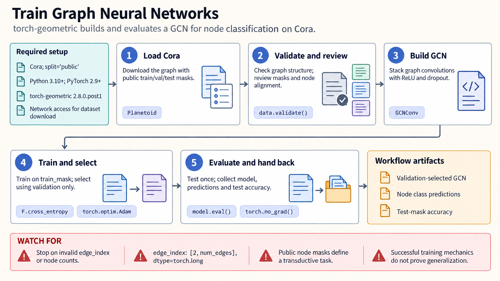

[All skill guides](README.md) / PyTorch Geometric

# PyTorch Geometric

**Build graph-learning experiments with explicit node, edge, and evaluation meanings.**

The PyTorch Geometric skill supports graph neural networks for node prediction, link prediction, and whole-graph tasks. It helps an assistant represent homogeneous or heterogeneous graphs, choose message-passing models, batch examples, and scale with supported sampling methods. The scientific meaning of graph construction and the split design remain central to the experiment.

*From relational research data to a checked graph-learning experiment.
[View the full-size workflow diagram](../images/torch-geometric.png).*

## Questions this skill can help you explore

- **Can relationships improve a prediction?** Train a node, edge, or graph model using documented connectivity and features.
- **How should multiple entity types be represented?** Build a heterogeneous graph with explicit node and relation types.
- **How can a large graph be handled?** Use compatible neighborhood sampling and batching while preserving the intended target nodes.
- **What kind of generalization is being tested?** Distinguish prediction within a known graph from prediction on unseen entities or graphs.

## What you bring

Provide node and edge tables, identifiers, features, labels, relation meanings, and directionality. Include isolated nodes explicitly rather than relying on the largest edge index to infer how many nodes exist.

Specify the prediction target, independent split unit, candidate negative-edge universe, class balance, and whether related molecules, patients, sites, or time periods should remain together. Explain how the graph was constructed and what information was available at prediction time.

## How the analysis works

1. **Define the graph contract.** Establish node identities, edge directions, features, types, and the prediction task.
2. **Validate representation.** Check indices, tensor shapes, isolated nodes, and graph consistency before modeling.
3. **Choose the model and loaders.** Match message passing, pooling, heterogeneous handling, or neighborhood sampling to the task.
4. **Train under a valid split.** Keep feature fitting and model selection within the intended information boundary.
5. **Evaluate and inspect.** Compare baselines and seeds, report class balance and split semantics, and examine errors and graph-construction sensitivity.

## What you get

| Output | What it helps you do |
| --- | --- |
| Validated graph objects | Preserve the meaning of nodes, edges, and features. |
| Graph neural-network model | Learn a representation appropriate to the selected task. |
| Training and sampling configuration | Reproduce batching and computational choices. |
| Prediction and evaluation summaries | Assess the stated graph-generalization question. |

## Example request

> Use the PyTorch Geometric skill to predict graph-level properties from my relational dataset. Validate node and edge identities, preserve isolated nodes, and keep related specimens in the same partition. Compare a graph model with a simpler baseline and report multiple seeds, split definitions, and failure patterns.

*This is an illustrative graph-learning request, not a demonstration of predictive benefit.*

## Interpreting the results

**A label mask on a known graph usually defines a transductive task.** It does not automatically test generalization to unseen nodes, edges, or independent graphs. Related structures across partitions can leak information even when labels are separated.

Graph construction, negative sampling, and feature availability influence what the model learns. A successful forward and backward pass checks mechanics rather than scientific validity. Attributions or message-passing patterns also do not establish causal interactions between entities.

## Get started

Use Python, compatible PyTorch, and torch-geometric. Basic layers need no optional extensions; sampling and some spatial operations require binaries matched to the exact platform and Torch build. Local work needs no credentials. Installation and dataset or model downloads require network access.

[Setup and technical instructions](../../skills/torch-geometric/SKILL.md)
