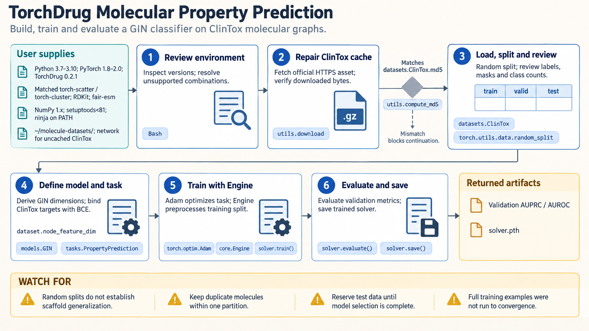

[All skill guides](README.md) / TorchDrug

# TorchDrug

**Develop molecular and protein graph-learning workflows in the package's supported environment.**

The TorchDrug skill guides the package's dataset, representation-model, task, and training-engine workflow. It covers molecular property prediction and documented extensions for pretraining, generation, retrosynthesis, proteins, and knowledge graphs. The guidance is especially useful when working with existing TorchDrug code whose older dependency stack and task conventions need careful handling.

*From molecular or protein records to a version-aware graph-learning experiment.
[View the full-size workflow diagram](../images/torchdrug.png).*

## Questions this skill can help you explore

- **Can molecular graphs predict a property?** Build a documented property-prediction task with suitable features and evaluation splits.
- **How should protein targets and representations align?** Match sequence or residue views to the task's label structure.
- **Can an existing TorchDrug workflow be reproduced?** Resolve package, device, feature, collation, and checkpoint mismatches.
- **What do generated or proposed structures need next?** Treat outputs as candidates requiring chemical and experimental review.

## What you bring

Provide the task, molecular or protein records, feature definitions, target labels, dataset provenance, and any existing code or checkpoint. Explain the evaluation objective and whether new scaffolds, entities, or reaction families should be held out.

Include the computing platform and installed package versions. Paired reaction views or multimodal labels need stable source identifiers so alignment and split membership can be verified.

## How it works

1. **Check environment compatibility.** Use the documented Python, PyTorch, graph-extension, and chemistry stack before adapting APIs.
2. **Load and inspect the dataset.** Confirm feature names, target shapes, valid structures, and source identifiers.
3. **Compose the workflow.** Choose a representation model, wrap it in the appropriate task, and use TorchDrug's engine or graph collation.
4. **Train with an appropriate split.** Keep duplicates or related structures together and synchronize paired dataset views.
5. **Evaluate and review outputs.** Report split sizes, class counts, model settings, checkpoint context, and scientific limitations.

## What you get

| Output | What it helps you do |
| --- | --- |
| Compatible experiment configuration | Reproduce an existing or planned TorchDrug workflow. |
| Molecular or protein representations | Support the chosen prediction or learning task. |
| Trained task and checkpoint | Preserve the model together with its task context. |
| Evaluation or candidate outputs | Inspect predictions or generated proposals under explicit boundaries. |

## Example request

> Use the TorchDrug skill to reproduce a molecular property-prediction workflow from my supplied data. Check the dependency versions, preserve molecule identifiers, and use a split that tests new scaffolds while keeping duplicates together. Report class counts and prediction performance, and flag assumptions that the benchmark does not test.

*This is an illustrative modeling request, not evidence of therapeutic performance.*

## Interpreting the results

**Random molecular splits can overstate generalization to unfamiliar chemistry.** Scaffold-based partitioning helps define a different task but still needs duplicate and provenance checks. Report the actual split sizes rather than assuming ideal fractions.

Generated molecules and retrosynthetic proposals are candidates, not demonstrations of experimental validity or synthesizability. A checkpoint must match the model, task, features, and vocabulary used to train it. Compatible imports alone do not validate every native operator or hardware path.

## Get started

The checked-in workflow targets TorchDrug 0.2.1 with a dedicated older Python and PyTorch stack, compatible graph extensions, RDKit, and fair-esm. Apple Silicon support is CPU-only and can require native builds. Installation and uncached datasets or weights need network access; local training has no service credentials.

[Setup and technical instructions](../../skills/torchdrug/SKILL.md)
