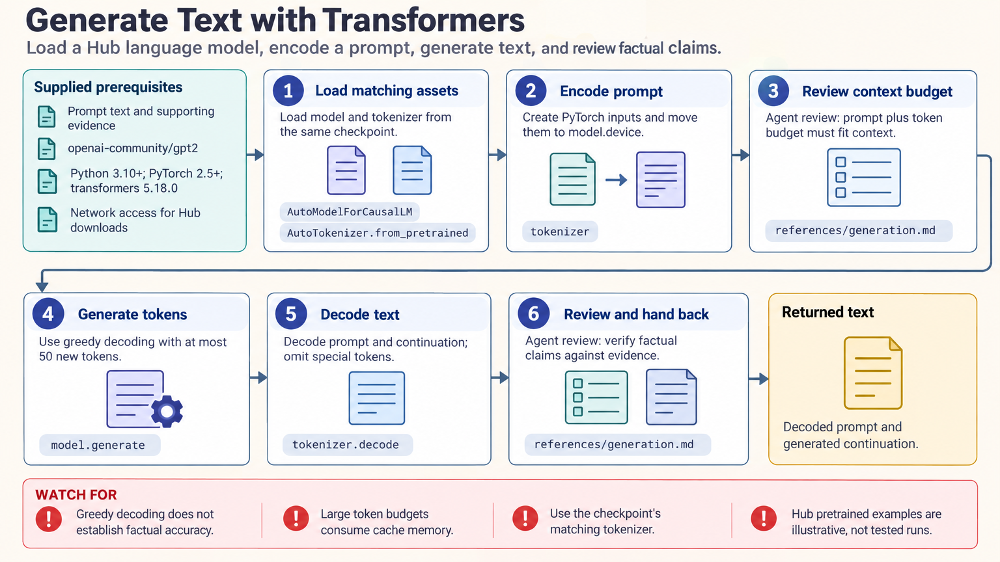

[All skill guides](README.md) / Transformers

# Transformers

**Use pretrained models and fine-tuning workflows with explicit checkpoints, preprocessing, and evaluation.**

The Transformers skill supports loading and using Hugging Face models for text, vision, audio, and multimodal tasks. It guides tokenization or other preprocessing, pipeline inference, text generation, and Trainer-based fine-tuning. For scientific work, the emphasis is on preserving model identity and testing whether outputs are useful for the actual research task.

*From a research modeling task to a reproducible pretrained-model workflow.
[View the full-size workflow diagram](../images/transformers.png).*

## Questions this skill can help you explore

- **Can a pretrained model support this task?** Select a compatible architecture and inspect its input and output contract.
- **How should the data be prepared?** Match tokenization, image processing, or audio preparation to the model.
- **Does adaptation improve the target use?** Fine-tune under a defined split and compare with an appropriate baseline.
- **How can the experiment be reproduced?** Record checkpoint revisions, label order, generation settings, exclusions, and saved artifacts.

## What you bring

Provide the research task, input modality, desired outputs, evaluation data, and a selected checkpoint or constraints on model choice. Include label definitions, independent units, document families, subjects, or time information relevant to splitting.

State available hardware, memory, intended model license use, and whether access is public, gated, or private. Explain truncation limits and which records or input segments must not be silently discarded.

## How it works

1. **Choose a model and environment.** Match architecture, task head, package versions, hardware, and checkpoint requirements.
2. **Prepare inputs consistently.** Load the appropriate tokenizer or processor and inspect shapes, masks, labels, sampling rates, and truncation.
3. **Run a bounded check.** Confirm inference or a small training step before expensive computation.
4. **Train or generate deliberately.** Record optimization, decoding, precision, and other settings while keeping selection within training and validation data.
5. **Evaluate and preserve.** Compare held-out baselines, inspect failures, and save model, processor, revisions, seeds, and preprocessing context.

## What you get

| Output | What it helps you do |
| --- | --- |
| Task-compatible inference pipeline | Apply a documented model and preprocessing combination. |
| Predictions or generated outputs | Examine the behavior relevant to the research task. |
| Fine-tuned model artifacts | Reuse an adapted model with its associated configuration. |
| Evaluation and provenance records | Review generalization, exclusions, and reproducibility. |

## Example request

> Use the Transformers skill to adapt a pretrained model for classifying my research documents. Keep related document families in one partition, verify label order and truncation, and compare against a baseline on held-out data. Save the checkpoint and processor together and report where predictions fail or confidence is poorly supported.

*This is an illustrative modeling request, not a validated classification or generation result.*

## Interpreting the results

**A model score is not automatically calibrated certainty, and generated fluency is not factual accuracy.** Decoding settings can change outputs without improving their evidence basis.

Pretraining, domain mismatch, related documents, and preprocessing leakage can affect evaluation. Tiny local execution checks do not validate downloaded pretrained checkpoints, distributed training, or every hardware path. Scientific claims need task-specific held-out evidence and review of errors, input exclusions, and model-use terms.

## Get started

Use Python, compatible PyTorch, and the documented Transformers stack. Particular modalities and training workflows need additional packages, codecs, or tools. Hub downloads require network access and storage; gated or private models additionally require an appropriately scoped Hugging Face token.

[Setup and technical instructions](../../skills/transformers/SKILL.md)
