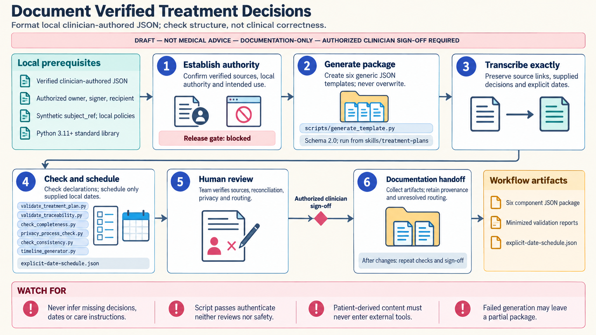

[All skill guides](README.md) / Treatment-Plan Documentation

# Treatment-Plan Documentation

**Organize and check documentation of decisions already supplied by authorized clinicians.**

This skill is a documentation workflow for existing, verified clinical decisions. It helps organize source facts, clinician-authored interventions, goals, checkpoints, shared-decision records, and handoff information in local structured files. The bundled tools perform deterministic structural checks and preserve unresolved items for human review; they do not make or assess treatment decisions.

*Keep source traceability and review status attached to documentation throughout the handoff. [View the full-size workflow diagram](../images/treatment-plans.png).*

## Questions this skill can help you explore

- **Can the supplied decisions be documented consistently?** Organize verified facts and interventions without inferring missing clinical content.
- **Which documentation fields or declarations remain incomplete?** Check structured records and identify unresolved field paths.
- **What belongs in the review handoff?** Preserve source references, ownership, supplied dates, and release requirements.

## What you bring

Start with synthetic examples or appropriately qualified de-identified structured records. The workflow needs exact clinician-authored decisions, source locators, verification details, accountable reviewers, intended recipients, and local governance requirements. Real patient-derived material requires a documented authorized local environment and must not be pasted into chat or sent to external services.

## How it works

1. **Establish ownership and intended use.** Identify the responsible clinical owner and confirm that every decision already exists in a verified source.
2. **Prepare the documentation package.** Create the generic local JSON templates and retain their draft status until required information and reviews are complete.
3. **Transcribe supplied content.** Preserve source identity and copy goals, interventions, dates, and documented preferences exactly; leave missing fields unresolved.
4. **Run structural checks.** Check schemas, declarations, field relationships, and supplied schedule dates without evaluating medical appropriateness.
5. **Complete authorized review.** Have the responsible team compare the package with its sources, resolve discrepancies, and release it through the approved records workflow.

## What you get

| Output | What it helps you do |
| --- | --- |
| Structured local documentation files | Keep supplied decisions, source facts, and handoff information organized. |
| Validation and completeness findings | Locate missing declarations or structural inconsistencies. |
| Supplied-date schedules and review records | Track documented checkpoints while retaining draft status and accountable ownership. |

## Example request

> Use the treatment-plan documentation skill on a synthetic package of already verified clinician-authored records. Populate the generic templates only from those supplied facts, preserve source references and dates, and run the local structural checks. List unresolved fields and keep release blocked for authorized human review.

*This is an illustrative request, not a reported research result.*

## Interpreting the results

**A structural pass does not establish clinical safety or authorize use for care.** The scripts cannot authenticate professional authority, a signature, completed review, or the truth of the supplied source content.

The skill does not select therapies, choose doses, check interactions, assess urgency, or infer missing clinical instructions. Its products remain documentation drafts requiring authorized clinician sign-off. Clinical reconciliation and other substantive checks belong to the responsible team and approved systems.

## Get started

The bundled tools use Python 3.11+ and the standard library, working only with local JSON files. They need no model, network connection, service credentials, image generator, or third-party runtime packages. Institutional authorization and privacy controls remain prerequisites for any patient-derived inputs.

[Setup and technical instructions](../../skills/treatment-plans/SKILL.md)
