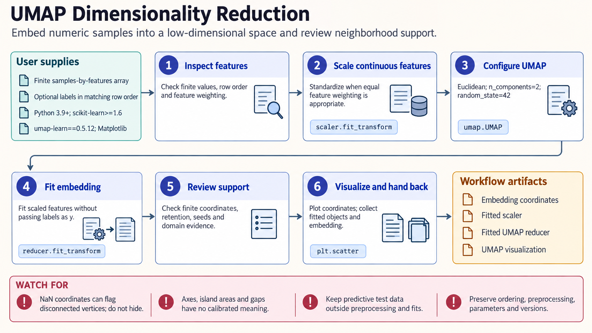

[All skill guides](README.md) / UMAP-Learn

# UMAP-Learn

**Explore high-dimensional measurements through lower-dimensional maps of neighborhood relationships.**

UMAP represents complex data in fewer dimensions, often as a two- or three-dimensional plot. This skill helps an assistant choose preprocessing, a similarity measure, and embedding settings, then check whether the resulting picture supports the intended exploratory use. It also covers label-guided embeddings, transformation of new data, and selected advanced UMAP workflows.

*Use the map to explore patterns while checking them against the original measurements. [View the full-size workflow diagram](../images/umap-learn.png).*

## Questions this skill can help you explore

- **Which observations have similar feature profiles?** Explore local relationships in a visual embedding.
- **Are the patterns stable?** Compare seeds, neighborhood settings, preprocessing, and relevant evidence in the original data.
- **Can an embedding support a predictive workflow?** Fit transformations within training data and assess their value on held-out observations.

## What you bring

Provide a finite observations-by-features matrix, stable observation identifiers, and the meaning and scale of each feature. State the similarity measure appropriate to the question and whether labels will influence the embedding. Predictive work also needs a predefined training and evaluation split and a plan for preprocessing.

## How it works

1. **Define what similarity means.** Choose a metric and preprocessing that fit the measurements rather than standardizing every dataset automatically.
2. **Fit an initial embedding.** Select the output dimension and neighborhood settings, documenting whether class labels are used.
3. **Inspect numerical and visual behavior.** Check finite coordinates, neighborhood retention, isolated observations, and sensitivity to seeds or parameters.
4. **Compare with independent evidence.** Review domain annotations and relationships in the original or another defensible feature space.
5. **Preserve the transformation.** Save settings and fitted preprocessing where appropriate, and keep test observations out of model selection.

## What you get

| Output | What it helps you do |
| --- | --- |
| Low-dimensional coordinates and plots | Explore neighborhoods and potential patterns among observations. |
| Sensitivity comparisons | See which visual features depend on analysis settings. |
| Fitted transformations or derived features | Support separately evaluated downstream workflows when the chosen method permits it. |

## Example request

> Use UMAP to explore this multivariate assay dataset. Explain the preprocessing and distance metric, compare several reasonable neighborhood settings and random seeds, and check whether the main visual patterns also appear in the original features. Label observations by sample metadata without treating visual separation as proof of distinct biological groups.

*This is an illustrative request, not a reported research result.*

## Interpreting the results

**UMAP axes, island areas, and gaps are not calibrated physical quantities.** An attractive plot does not establish distinct populations, preserved density, or meaningful global distances. Dimensionality reduction can create or obscure apparent clusters.

In supervised UMAP, labels help determine the separation, so the map is not independent evidence that those classes were discovered. Predictive preprocessing and embedding choices must be fitted within training folds and evaluated on genuinely held-out data.

## Get started

The documented package requires Python 3.9+ and umap-learn with its numerical dependencies. Plotting, clustering, and parametric workflows use additional packages such as Matplotlib, HDBSCAN, or TensorFlow/Keras. Installation needs network access unless packages are available locally; ordinary fitting needs no service credentials.

[Setup and technical instructions](../../skills/umap-learn/SKILL.md)
