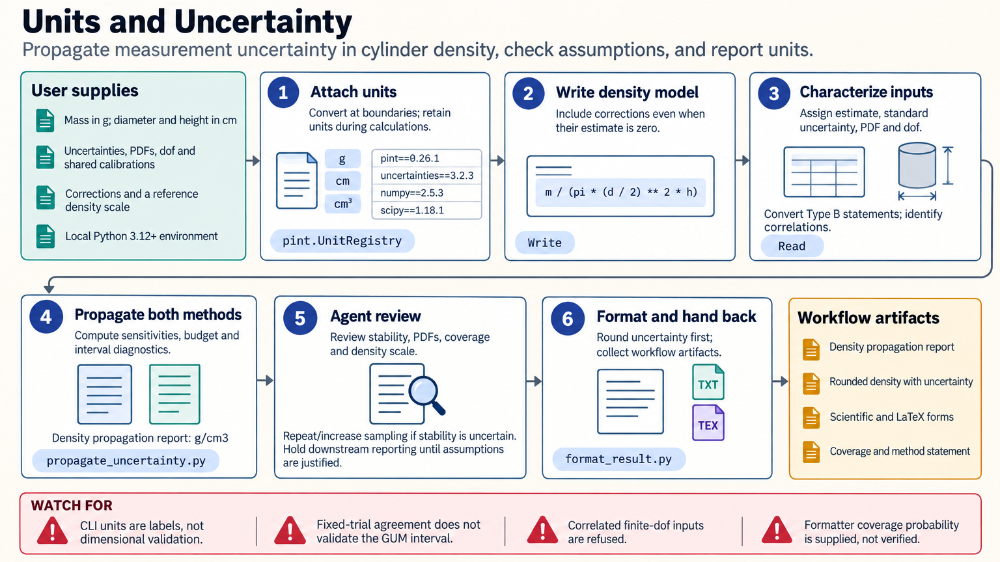

[All skill guides](README.md) / Uncertainty and Units

# Uncertainty and Units

**Carry units, measurement uncertainty, and physical plausibility through scientific calculations.**

This skill helps an assistant turn measured inputs into a result whose units and uncertainty are interpretable. It supports dimensional checks, uncertainty budgets, correlated inputs, coverage factors, Monte Carlo propagation, and consistent reporting. It also checks whether a result has a plausible physical scale, since correct dimensions alone do not establish a sensible answer.

*Keep the measurement model and the meaning of the reported uncertainty visible. [View the full-size workflow diagram](../images/uncertainty-and-units.png).*

## Questions this skill can help you explore

- **Are these units and conversions consistent?** Track dimensions and distinguish ordinary scale changes from conversions that need physical context.
- **Which measurements dominate the uncertainty?** Build a contribution budget using sensitivities and correlated components.
- **What does the reported plus-or-minus mean?** State standard or expanded uncertainty, the coverage method, and appropriate rounding.

## What you bring

Provide the measurement equation, every input value and unit, and the origin of each uncertainty estimate. Include calibration corrections, distributions or limits, degrees of freedom where relevant, and known shared uncertainty components. Specify the desired output unit, coverage statement, and any known physical scale or regime for comparison.

## How it works

1. **Write the measurement model.** Include relevant corrections even when their estimated value is zero, and attach units at input.
2. **Characterize input uncertainty.** Convert repeatability, certificates, specifications, or bounds into justified standard uncertainties and retain correlations.
3. **Propagate and inspect contributions.** Calculate the effect of each input on the result using a method appropriate to the model.
4. **Check the approximation and magnitude.** Assess nonlinearity, numerical stability, and physical plausibility before trusting a coverage interval.
5. **Report consistently.** Round uncertainty and value together and state the coverage factor, interpretation, assumptions, and method.

## What you get

| Output | What it helps you do |
| --- | --- |
| Unit conversions and dimensional findings | Identify scale, unit, or offset-temperature mistakes. |
| Uncertainty budgets and propagated results | Trace the contributions that determine reported precision. |
| Formatted values and plausibility reports | Present results with explicit coverage and physical context. |

## Example request

> Use the uncertainty-and-units skill to review my measurement calculation. Preserve units, include the shared calibration uncertainty, and show the contribution of each input. Check whether linear propagation is adequate, assess the result's physical scale, and report the final value with a justified uncertainty and coverage statement.

*This is an illustrative request, not a reported research result.*

## Interpreting the results

**Propagation is only as defensible as the measurement model and input assumptions.** A precise output can omit an important correction or shared source of error. Independent treatment of correlated inputs can materially change the uncertainty.

A default coverage factor is not universally justified, and first-order propagation may be unreliable for nonlinear or boundary-sensitive calculations. Monte Carlo simulation also requires suitable input distributions and a numerical stability check. These tools do not replace statistical study design or model selection.

## Get started

Numeric helpers run locally with Python 3.12+, Pint, uncertainties, NumPy, and SciPy. The static code auditor uses the standard library. Bundled calculations require no network access or service credentials; unit-aware table and array integrations are optional separate packages.

[Setup and technical instructions](../../skills/uncertainty-and-units/SKILL.md)
