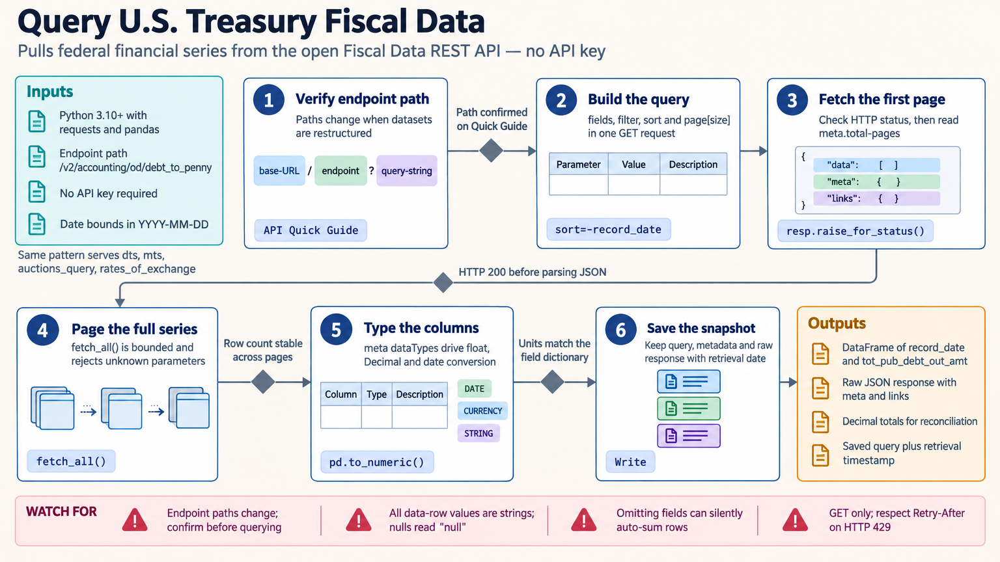

[All skill guides](README.md) / U.S. Treasury Fiscal Data

# U.S. Treasury Fiscal Data

**Retrieve federal fiscal records with the dates, units, and table definitions needed for reproducible research.**

This skill helps an assistant query the U.S. Treasury Fiscal Data API for debt, revenue, expenditure, securities, interest, and reporting exchange-rate datasets. It supports selecting records, handling paginated responses, and turning returned values into analysis-ready tables. The focus is accurate retrieval and interpretation of the published data rather than financial forecasting or investment decisions.

*Preserve the fiscal meaning of each record as it moves from the source API to an analysis table. [View the full-size workflow diagram](../images/usfiscaldata.png).*

## Questions this skill can help you explore

- **What did Treasury report for this period?** Retrieve records from the relevant debt, cash, revenue, or expenditure dataset.
- **How has a published series changed?** Assemble a reproducible sequence of observations with explicit dates and units.
- **Which data definitions affect the comparison?** Inspect record dates, event dates, cumulative measures, and reporting categories.

## What you bring

Define the research question, dataset of interest, date range, required fields, and desired output. State whether the analysis concerns balances, period flows, cumulative fiscal-year totals, auctions, or reporting rates. Identify the intended frequency and aggregation level so the query does not combine incompatible quantities.

## How it works

1. **Locate the appropriate dataset.** Check its official API guide and data dictionary for the fields and endpoint relevant to the question.
2. **Specify a bounded query.** Select dates, filters, sorting, fields, and retrieval limits while retaining the original record grain.
3. **Retrieve every required page.** Compare returned records with pagination metadata and record incomplete retrieval explicitly.
4. **Convert and validate values.** Parse numeric and date strings, handle the documented null representation, and check units and missing fields.
5. **Save the data and query context.** Keep dataset identity, parameters, retrieval date, source definitions, and any transformations with the output.

## What you get

| Output | What it helps you do |
| --- | --- |
| Filtered fiscal data tables | Prepare published records for descriptive or policy research. |
| Reproducible query records | Repeat or update a retrieval with known filters and date coverage. |
| Interpretation notes | Document units, timing, aggregation, and completeness limits. |

## Example request

> Use the U.S. Treasury Fiscal Data skill to assemble a monthly research table for my specified fiscal series and date range. Verify the amount fields and units, retrieve all required pages, and preserve publication and period dates. Explain whether the values are monthly flows, cumulative totals, or balances before calculating changes.

*This is an illustrative request, not a reported research result.*

## Interpreting the results

**Balances, period flows, and cumulative totals cannot be aggregated in the same way.** Summing fiscal-year-to-date values across months double-counts earlier activity. Omitting fields from a request can also trigger aggregation, so inspect the full table structure first.

Event dates can differ from publication dates, and reporting exchange rates are not live trading quotes. Revisions, effective dates, unit scales, and table-specific definitions need to accompany any comparison. Successful retrieval does not itself establish an economic explanation.

## Get started

The API requires network access but no key or registration. Documented Python examples use Python 3.10+, requests, and pandas; R examples use httr and jsonlite. Local analysis can then use the saved tables with their source and query metadata.

[Setup and technical instructions](../../skills/usfiscaldata/SKILL.md)
