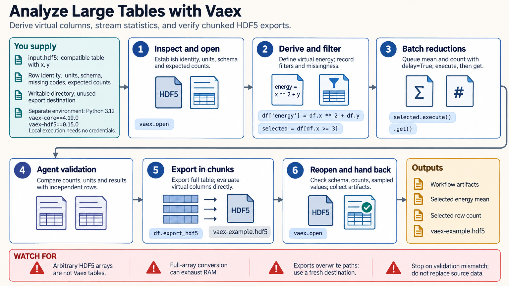

[All skill guides](README.md) / Vaex

# Vaex

**Explore large scientific tables with deferred expressions, streamed summaries, and binned visualizations.**

Vaex supports columnar analysis of datasets that can be larger than a machine's RAM. This skill helps an assistant work with compatible local files, define virtual columns, calculate summaries, and visualize aggregated data without unnecessarily materializing the full table. It also explains which operations still require substantial memory and how to preserve scientific meaning during conversion and filtering.

*Explore large datasets while retaining row identity, measurement units, and explicit selection rules. [View the full-size workflow diagram](../images/vaex.png).*

## Questions this skill can help you explore

- **How can I inspect a table that exceeds memory?** Use supported storage formats, selected columns, and bounded summaries.
- **Can I derive features without storing every intermediate array?** Represent transformations as expressions or virtual columns.
- **How can I visualize many observations?** Use binned counts or statistics with explicit limits and resolution.

## What you bring

Provide the table files, expected row counts, schema, identifiers, units, and missing-value conventions. State the desired filters, groupings, derived measurements, and outputs. Include available memory and storage, and define study partitions before any machine-learning preprocessing or fitting.

## How it works

1. **Check the input structure.** Verify file compatibility and column types, including identifiers, dates, and duplicate raw headers.
2. **Open and select deliberately.** Read the appropriate format, retain required columns, and account for indexing or decoding work.
3. **Define transformations and selections.** Use expressions while recording filters, missingness, and the meaning of each summary denominator.
4. **Compute and visualize bounded results.** Calculate suitable reductions or aggregated grids, comparing representative values with an independently checked subset.
5. **Export and reopen.** Write outputs in chunks where appropriate and confirm their schema, counts, and values before replacing any source material.

## What you get

| Output | What it helps you do |
| --- | --- |
| Filtered views and virtual features | Explore derived measurements without storing unnecessary full intermediates. |
| Streamed statistics and binned plots | Review large-scale patterns at an explicit aggregation level. |
| Converted or exported tables | Prepare reusable datasets with checked schema and provenance. |

## Example request

> Use Vaex to explore my large local measurement table. Preserve sample identifiers and units, define the requested filters and virtual features, and compute grouped summaries without converting the entire dataset to an in-memory array. Produce binned plots with visible coverage and verify the exported results against a small independent subset.

*This is an illustrative request, not a reported research result.*

## Interpreting the results

**Larger-than-memory storage does not make every operation memory bounded.** Sorting, joins, large group dictionaries, conversion to another table library, and many model fits can still require full arrays or large intermediate structures.

A count heatmap and a mean heatmap answer different questions. Binning, selection, and approximate summaries can conceal sparse regions or extreme observations unless coverage and resolution are reported. Saved transformation state does not contain the original data or establish its provenance.

## Get started

The documented Vaex core requires Python 3.9–3.12 in a compatible environment. Install HDF5, visualization, or machine-learning extensions only as needed; specialized formats have additional dependencies. Local processing needs no credentials, while installation and remote data access require network access.

[Setup and technical instructions](../../skills/vaex/SKILL.md)
