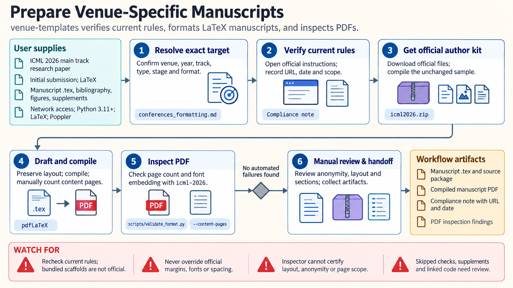

[All skill guides](README.md) / Venue Templates

# Venue Templates

**Prepare research documents around the requirements of the exact venue and submission stage.**

Journal, conference, poster, and grant requirements vary by venue, track, year, and document type. This skill helps an assistant locate the governing instructions, choose an appropriate template, adapt supplied research content, and inspect the resulting document. Its bundled LaTeX files are drafting aids whose status must be distinguished from an official author kit.

*Connect every formatting decision to the intended venue, document type, and submission stage. [View the full-size workflow diagram](../images/venue-templates.png).*

## Questions this skill can help you explore

- **Which template and rules apply?** Resolve the specific venue, cycle, track, article or proposal type, and submission stage.
- **How should the document be organized?** Adapt content to the required sections and the venue's audience without changing the evidence.
- **Does the finished file meet the checked requirements?** Inspect page counts, fonts, anonymity, and other relevant submission details.

## What you bring

Provide the target venue or funding call, year or cycle, track, document type, and submission stage. Supply the manuscript or proposal content, figures, references, author details, and any official template already obtained. Identify the required authoring format and any submission components that must be handled separately.

## How it works

1. **Resolve the exact target.** Separate similarly named tracks, article types, and initial, revision, or final submission rules.
2. **Verify official instructions.** Consult the current author guidance or solicitation and record the source and date checked.
3. **Choose the correct starting file.** Use the official template when required, keeping its style definitions intact; label bundled scaffolds as drafting aids.
4. **Adapt and compile.** Fit the supplied content to required sections and audience, resolving placeholders and checking the generated document.
5. **Inspect the final deliverable.** Review applicable page limits, fonts, anonymity, statements, figures, and separate upload requirements against the verified instructions.

## What you get

| Output | What it helps you do |
| --- | --- |
| A venue-specific requirements note | Record which rules were checked and where they came from. |
| An adapted manuscript, proposal, or poster scaffold | Prepare content in a suitable authoring structure. |
| PDF inspection findings and a review checklist | Locate format issues that still need correction or manual verification. |

## Example request

> Use the venue-templates skill to prepare my manuscript for the specified conference track and submission stage. Verify the current official instructions, use its author kit, and preserve the supplied research claims and references. Check page counts, fonts, anonymity, and required statements, and list any requirements that still need manual confirmation.

*This is an illustrative request, not a reported research result.*

## Interpreting the results

**A bundled scaffold is not automatically an official or current template.** Requirements can change between years and stages, and rules from one track must not be transferred to another without confirmation.

Mechanical checks cover only the properties they inspect. A readable PDF or acceptable page count does not establish complete submission compliance, scientific quality, or acceptance. Grant components may require separate forms or uploads rather than one combined document.

## Get started

Local helpers require Python 3.11+ and the standard library. LaTeX is needed when compiling LaTeX sources, and Poppler supports PDF inspection. Network access is needed to verify current venue instructions and obtain official author kits; the local helpers themselves do not fetch remote content.

[Setup and technical instructions](../../skills/venue-templates/SKILL.md)
