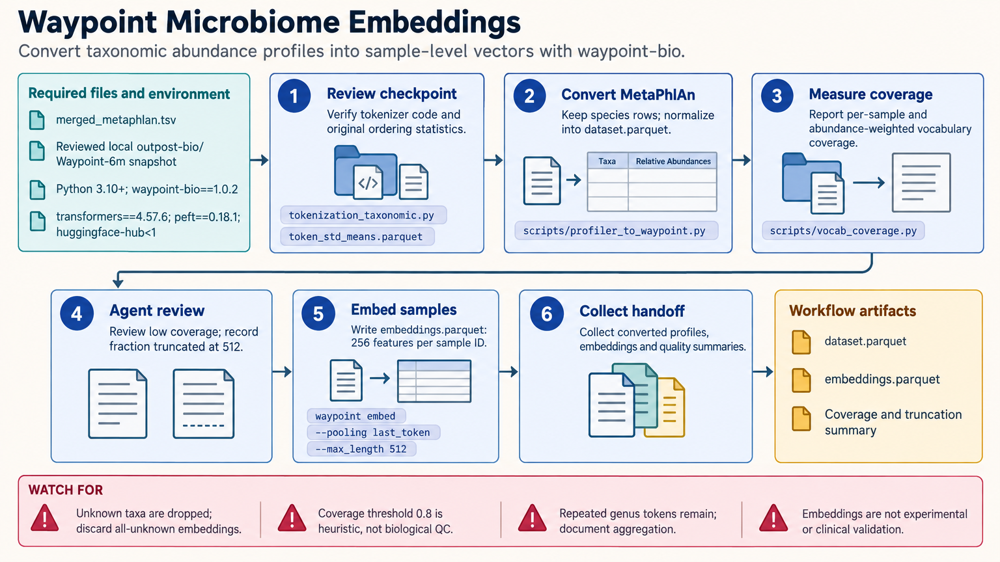

[All skill guides](README.md) / Waypoint Microbiome Models

# Waypoint Microbiome Models

**Explore learned representations of microbiome composition with explicit taxonomy and evaluation checks.**

Waypoint represents microbiome samples as ordered taxonomic tokens and uses pretrained models to produce sample embeddings or support downstream prediction. This skill connects profiler-output conversion, vocabulary checks, model use, and benchmarking. It also covers the associated Atlas corpus and Compass benchmark while separating documented workflows from results that still require a completed scientific experiment.

*Check what taxonomic information the model actually receives before interpreting its outputs. [View the full-size workflow diagram](../images/waypoint-bio.png).*

## Questions this skill can help you explore

- **Can these abundance profiles become model inputs?** Convert supported profiler outputs while preserving sample identifiers and taxonomy.
- **How much of each sample is represented?** Measure taxonomic and abundance-weighted coverage against the model vocabulary.
- **Do learned features improve this research task?** Compare embeddings or fine-tuning with suitable baselines under the same evaluation split.

## What you bring

Provide taxonomic abundance profiles, full lineage labels, sample metadata, sequencing or profiling context, and the research target. Include study, batch, subject, or run groupings needed to avoid leakage. Identify the intended model checkpoint and a compatible revision of its tokenizer and ordering statistics.

## How it works

1. **Prepare the biological input.** Convert profiler-specific formats to aligned lists of taxa and relative abundances, preserving sample identity.
2. **Check representation coverage.** Review unknown taxa and abundance-weighted coverage before creating embeddings. Report sequence-length truncation separately: even recognized taxa can be dropped when a sample exceeds the model's input limit.
3. **Pin compatible model resources.** Use a reviewed model, tokenizer, and statistics snapshot with the documented software environment.
4. **Choose the research workflow.** Generate embeddings or prepare a supported modeling experiment, checking known package limitations before training or export.
5. **Evaluate independently.** Compare with an abundance-based baseline, preserve study-aware splits, and report performance alongside coverage and preprocessing decisions.

## What you get

| Output | What it helps you do |
| --- | --- |
| Converted abundance datasets and coverage reports | Identify whether input taxonomy is represented by the selected model. |
| Sample embeddings | Explore learned representations for separately evaluated downstream tasks. |
| Modeling or benchmark records | Connect any completed evaluation to its data split, checkpoint, and preprocessing. |

## Example request

> Use the Waypoint skill to assess my microbiome abundance dataset for a research classification task. Convert the profiler output, preserve full lineages and sample IDs, and report vocabulary coverage first. Compare a suitable embedding workflow with an abundance-based baseline using study-aware splits, and identify package limitations before attempting fine-tuning.

*This is an illustrative request, not a reported research result.*

## Interpreting the results

**Model inputs can lose biologically important information.** Unknown taxa may be dropped, genus-level mapping can leave repeated tokens, and relative abundances are compositional. Low vocabulary coverage or inconsistent profiling can make an apparently valid embedding misleading.

Predictions and co-occurrence patterns do not establish mechanism or clinical validity. Known tokenizer-saving limitations can block some training and export paths, and behavior differs between the documented package and source versions. Check those boundaries rather than treating an example command as a completed workflow.

## Get started

The workflow requires Python 3.10+, waypoint-bio, and its documented compatible model-library stack. Hub downloads require network access, appropriate repository access, and a Hugging Face token. Local conversion does not require Hub access, while training can require substantial memory and a GPU.

[Setup and technical instructions](../../skills/waypoint-bio/SKILL.md)
