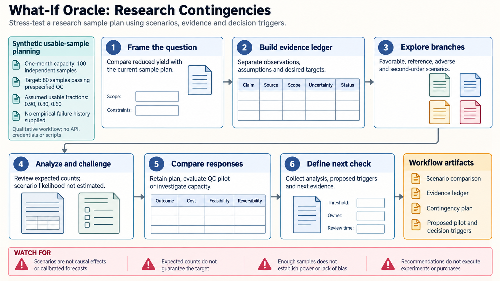

[All skill guides](README.md) / What-If Oracle

# What-If Oracle

**Stress-test a research plan against explicit scenarios and define practical contingencies.**

This skill structures qualitative scenario analysis around a scientific decision: what could change, why it might matter, and what evidence would justify a response. It explores favorable, reference, adverse, disruptive, alternative, and downstream scenarios without treating them as predictions. The output is a comparison of assumptions, consequences, and proposed actions for research planning.

*Turn uncertain research conditions into explicit assumptions, checks, and contingency choices. [View the full-size workflow diagram](../images/what-if-oracle.png).*

## Questions this skill can help you explore

- **What could make this study plan fail or change?** Examine sample loss, method transfer, unavailable resources, or competing scientific assumptions.
- **Which actions remain workable across scenarios?** Compare feasibility, cost, reversibility, and unresolved dependencies.
- **What should we monitor next?** Define observations, review points, and response triggers that could change the decision.

## What you bring

Describe the scientific decision, current plan, alternatives, time horizon, population or experimental system, and measurable success criteria. Provide available evidence, resource constraints, and the main possible changes. Separate observed quantities from model-derived estimates and planning assumptions, including dependencies between them.

## How it works

1. **Frame one operational question.** Specify the decision, comparator, perturbation, horizon, and relevant constraints.
2. **Build an evidence ledger.** Record sources, dates, uncertainties, conflicting observations, and which claims remain assumptions.
3. **Explore distinct scenarios.** Use a bounded set of plausible conditions while retaining shared drivers and correlated changes.
4. **Compare responses.** Assess the current plan and alternatives against outcomes, costs, feasibility, and reversibility.
5. **Define the next check.** Identify an observation or pilot that could distinguish scenarios and assign practical review triggers, responsibilities, and proposed responses.

## What you get

| Output | What it helps you do |
| --- | --- |
| Scenario comparison | Make the consequences of different assumptions easier to inspect. |
| Evidence and assumption ledger | Separate supplied observations from hypotheses and estimates. |
| Contingency and monitoring plan | Prepare conditional responses without executing experiments or purchases. |

## Example request

> Use the What-If Oracle skill to stress-test our planned sample-collection study. Consider lower usable-sample yield, delayed assay access, and a method that transfers poorly to the new site. Keep linked assumptions together, compare feasible contingencies, and identify the smallest pilot or monitoring signal that could change our preferred plan.

*This is an illustrative request, not a reported research result.*

## Interpreting the results

**A scenario narrative is not a forecast probability or a causal estimate.** Plausibility labels do not justify numerical likelihoods, and a persuasive explanation is not independent evidence. Quantitative claims need an explicit method, inputs, and uncertainty.

Robustness applies only to the scenarios examined; the exercise does not cover every possible future. Favorable and adverse cases are not proven upper or lower bounds. A proposed trigger is a planning rule, not automatically a statistical test or demonstration of a mechanism.

## Get started

The qualitative workflow needs no package, API, credentials, or network connection when based entirely on supplied material. Current external facts require verification when relevant. Numerical simulations, power calculations, or causal analyses need their own suitable methods and evidence beyond this planning framework.

[Setup and technical instructions](../../skills/what-if-oracle/SKILL.md)
