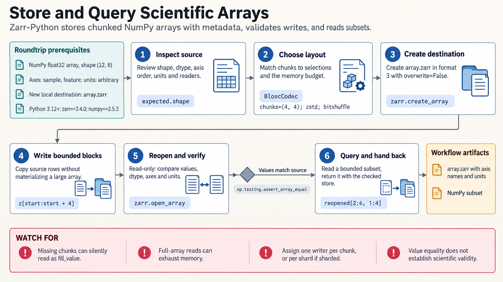

[All skill guides](README.md) / Zarr Python

# Zarr Python

**Store and access large scientific arrays in chunks while preserving their dimensions and measurement metadata.**

Zarr stores multidimensional arrays as independently accessible chunks, making it useful for imagery, simulations, and other large scientific datasets. This skill helps an assistant choose an array layout, compression, and storage backend, then verify the written values and metadata. It also covers integration with NumPy, Dask, and Xarray and careful movement between supported storage formats.

*Design storage around actual scientific selections and verify both data and meaning after writing. [View the full-size workflow diagram](../images/zarr-python.png).*

## Questions this skill can help you explore

- **How should this dataset be divided into chunks?** Choose a layout based on expected slices, memory limits, and representative access patterns.
- **Can I read only part of a large array?** Use bounded selections or suitable lazy operations rather than materializing the full dataset.
- **Will another analysis interpret the store correctly?** Preserve axis order, coordinates, units, missing-value conventions, and reader compatibility.

## What you bring

Provide the array shape, data type, axis names and order, coordinates, units, and missing-data convention. Describe how the dataset will be read and updated, the expected consumers, available memory and storage, and whether the destination is local or remote. Include any migration or interoperability requirements.

## How it works

1. **Specify the data contract.** Record dimensions, identifiers, metadata, intended readers, and the on-disk format separately from the package version.
2. **Plan chunks and compression.** Match layout to real selections and memory needs, checking representative data rather than relying on one universal chunk size.
3. **Write to a new destination.** Use bounded blocks and explicit ownership of each chunk or shard; coordinate metadata and resizing separately.
4. **Reopen and compare.** Verify values, shape, types, coordinates, units, masks, and completeness through read-only checks.
5. **Prepare for downstream use.** Check the actual readers and refresh any consolidated metadata after changes before sharing the completed store.

## What you get

| Output | What it helps you do |
| --- | --- |
| Chunked array stores | Read and process selected regions of a large scientific dataset. |
| Documented layout and metadata | Preserve the meaning of axes, values, coordinates, and missing observations. |
| Round-trip and compatibility checks | Identify data loss, incomplete writes, or consumer mismatches. |

## Example request

> Use the Zarr Python skill to store my multidimensional microscopy array. Preserve channel, time, and spatial coordinates and units, and choose chunks for the slices we actually analyze. Write to a new destination in bounded blocks, reopen it read-only, and compare values, masks, metadata, and compatibility with the intended downstream reader.

*This is an illustrative request, not a reported research result.*

## Interpreting the results

**Opening a store successfully does not prove that every intended value was written.** Missing or unwritten chunks can read as the fill value, making an incomplete dataset appear valid unless completeness is checked.

Chunking improves selective access but does not prevent full-array materialization. Concurrent writes require coordination, especially when several chunks share a stored shard. Axis names and units are declarations rather than automatic transformations or scientific validation, and storage-format compatibility must be checked with each consumer.

## Get started

The documented Zarr-Python stack requires Python 3.12+, Zarr 3, and NumPy 2 or later. Local stores need no credentials. Remote access requires network connectivity and the appropriate storage backend, with provider credentials for private stores; Dask, Xarray, and migration interfaces have additional dependencies.

[Setup and technical instructions](../../skills/zarr-python/SKILL.md)
