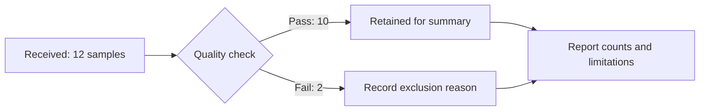
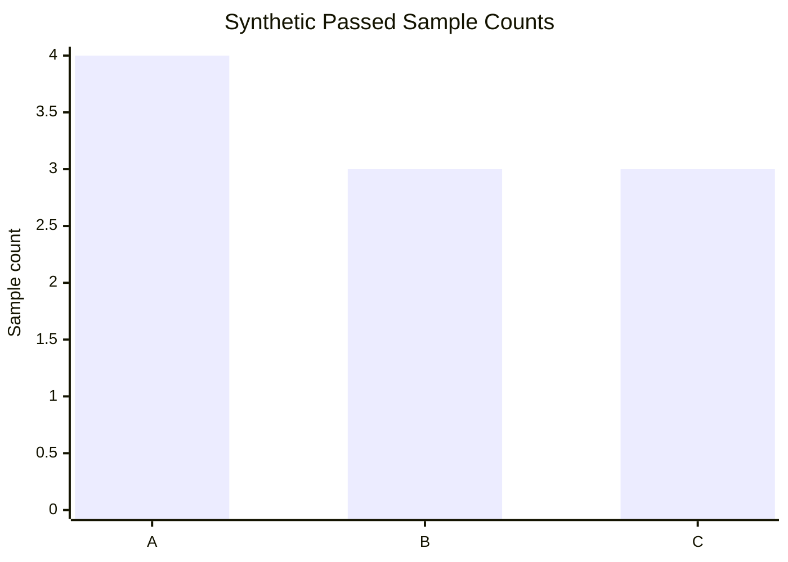
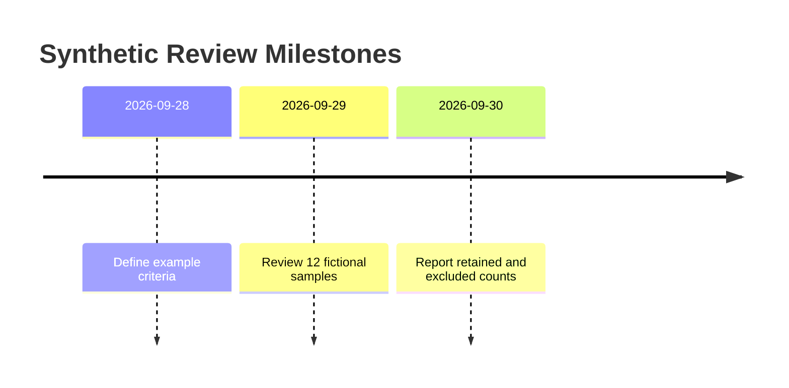

# Synthetic Assay Quality-Control Report

_Format example only — every sample count and date below is invented. No experiment,
statistical inference, or scientific software execution is reported._

---

## 📋 Scope

This example shows how a Markdown report can preserve a workflow, exact counts,
and an accessible chart. It does not recommend an assay protocol or biological
threshold. In a real report, specify the measurement method, prespecified exclusion
criteria, unit of replication, data location, and software versions.

## 🔄 Workflow

The diagram separates failed quality checks from the samples retained for analysis.
An arrow means a processing step, not a causal biological relationship.

## 📊 Illustrative results

Counts are deliberately small enough to audit: each batch has four received samples;
passed plus failed equals received. The overall pass fraction is 10/12 (83.3%),
a description of these invented counts rather than an estimate of assay performance.

| Fictional batch | Received | Passed | Failed |
| --- | ---: | ---: | ---: |
| A | 4 | 4 | 0 |
| B | 4 | 3 | 1 |
| C | 4 | 3 | 1 |
| Total | 12 | 10 | 2 |

_The chart shows passed sample counts, with a common zero-based count axis. The table
above supplies every value independently of color or screen-reader SVG support._

## 📅 Illustrative chronology

_The fictional workflow records planning, quality review, and reporting in order.
Timeline spacing is categorical; it does not encode elapsed durations._

## 🔍 Interpretation and limits

These figures demonstrate Markdown/Mermaid formatting. They provide no evidence of
biological efficacy, group differences, causality, or reproducibility of an assay.
For a real analysis, retain raw observations and plot uncertainty using appropriate
scientific software; do not manufacture a significance test from this count table.

Record to add for a real analysis

- Dataset identifier, version, and access date.
- Unit of replication and prespecified quality criteria.
- A reason for each excluded sample, with identifiers that respect privacy.
- Analysis code, environment versions, and source data for every quantitative figure.

---

## 🔗 Rendering reference

The syntax follows [official Mermaid XY chart documentation](https://mermaid.js.org/syntax/xyChart.html).
The named bar legend requires Mermaid 11.17.0+; all three diagrams rendered locally
with Mermaid 12.0.0. Check the intended destination separately.
