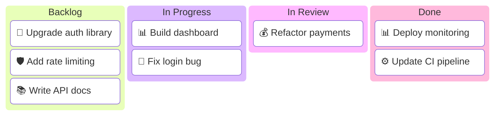
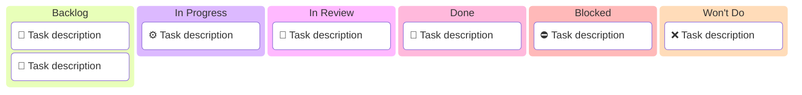
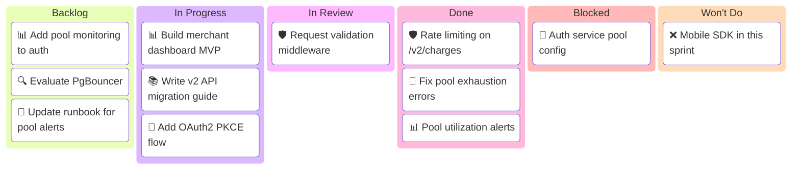

<!-- Source: https://github.com/SuperiorByteWorks-LLC/agent-project | License: Apache-2.0 | Author: Clayton Young / Superior Byte Works, LLC (Boreal Bytes) -->

# Kanban Board

> **Back to [Style Guide](../mermaid_style_guide.md)** — Read the style guide first for emoji, color, and accessibility rules.

**Syntax keyword:** `kanban`
**Best for:** Task status boards, workflow columns, work-in-progress visualization, sprint status
**When NOT to use:** Task timelines/dependencies (use [Gantt](gantt.md)), process logic (use [Flowchart](flowchart.md))

> ⚠️ **Accessibility:** Kanban boards do **not** support `accTitle`/`accDescr`. Always place a descriptive _italic_ Markdown paragraph directly above the code block.

---

## Exemplar Diagram

_Kanban board showing the current sprint's work items distributed across four workflow columns, with emoji indicating column status:_

> ⚠️ **Tip:** Each task gets ONE domain emoji at the start — this is your primary visual signal for categorization. Column emoji indicates workflow state.

---

## Tips

- Name columns with **status emoji** for instant visual scanning
- Add **domain emoji** to tasks for quick categorization
- Keep to **3–5 columns**
- Limit to **3–4 items per column** (representative, not exhaustive)
- Items are simple text descriptions — keep concise
- Good for sprint snapshots in documentation
- **Always** pair with a Markdown text description above for screen readers

---

## Template

_Description of the workflow columns and what the board represents. This example uses 6 columns; adapt to the actual workflow:_

> ⚠️ This example includes 6 columns — Backlog, In Progress, In Review, Done, Blocked, Won't Do. Even if a column is empty, include a placeholder item like [No items yet] to make the structure explicit.

---

## Complex Example

_Sprint W07 board for the Payments Team showing a realistic distribution of work items across all six columns, including blocked items:_

Tips for complex kanban diagrams:

- Add a Blocked column to surface stalled work — this is the highest-signal column on any board
- Keep items to 3–4 per column max even in complex boards — the diagram is a summary, not an exhaustive list
- Use the same emoji per domain across columns for visual tracking (📊 = dashboards, 🛡️ = security, 🐛 = bugs)
- This example uses 6 columns; adapt to the actual workflow — use placeholder items like [No items] when a column is empty

## Verified reference

Syntax examples reviewed against [official Mermaid documentation](https://mermaid.js.org/syntax/kanban.html) and rendered with Mermaid 12.0.0 (2026-10-01). Check the destination version; appearance and accessibility are not guaranteed by a successful parse.
