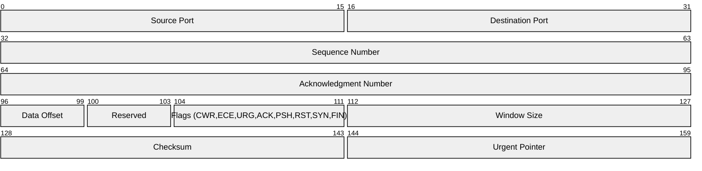
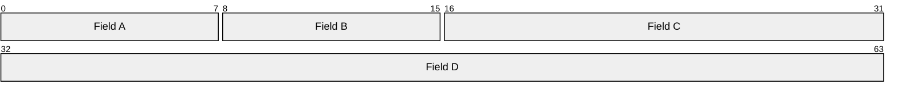

<!-- Source: https://github.com/SuperiorByteWorks-LLC/agent-project | License: Apache-2.0 | Author: Clayton Young / Superior Byte Works, LLC (Boreal Bytes) -->

# Packet Diagram

> **Back to [Style Guide](../mermaid_style_guide.md)** — Read the style guide first for emoji, color, and accessibility rules.

**Syntax keyword:** `packet-beta`
**Best for:** Network protocol headers, data structure layouts, binary format documentation, bit-level specifications
**When NOT to use:** General data models (use [ER](er.md)), system architecture (use [C4](c4.md) or [Architecture](architecture.md))

> **Accessibility:** Mermaid 12.0.0 emits `accTitle`/`accDescr` for this type. Keep a visible description and verify older destination renderers.

---

## Exemplar Diagram

_Packet diagram showing the fixed 160-bit TCP header portion with field sizes in bits (options and payload omitted):_

---

## Tips

- Ranges are inclusive `start-end:` bit offsets (0-indexed). A `0-15` field is 16 bits
- The TCP example follows [RFC 9293 section 3.1](https://www.rfc-editor.org/rfc/rfc9293.html#section-3.1); state byte/bit order and optional fields for any real protocol
- Keep field labels concise — abbreviate if needed
- Use for any fixed-width binary format, not just network packets
- Row width defaults to 32 bits — fields wrap naturally
- **Always** pair with a Markdown text description above for screen readers

---

## Template

_Description of the protocol or data format and its field structure:_

## Verified reference

Syntax examples reviewed against [official Mermaid documentation](https://mermaid.js.org/syntax/packet.html) and rendered with Mermaid 12.0.0 (2026-10-01). Check the destination version; appearance and accessibility are not guaranteed by a successful parse.
