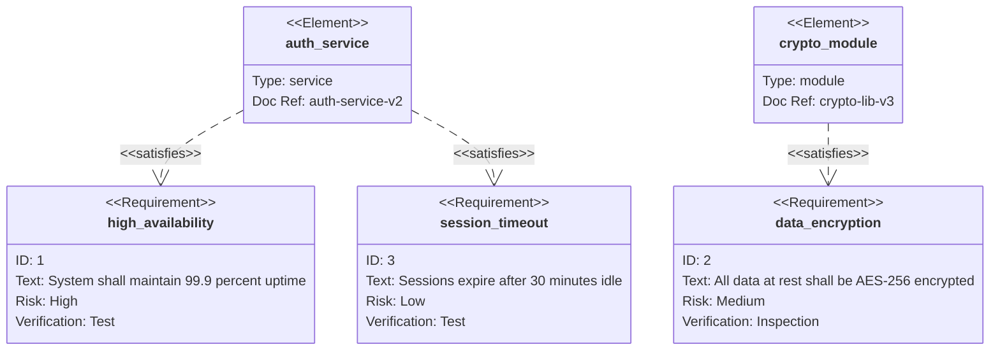
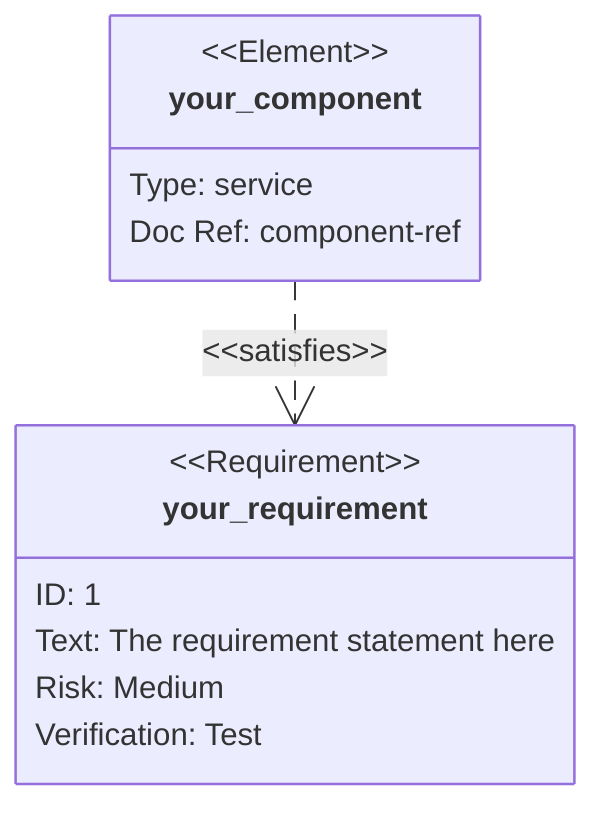

<!-- Source: https://github.com/SuperiorByteWorks-LLC/agent-project | License: Apache-2.0 | Author: Clayton Young / Superior Byte Works, LLC (Boreal Bytes) -->

# Requirement Diagram

> **Back to [Style Guide](../mermaid_style_guide.md)** — Read the style guide first for emoji, color, and accessibility rules.

**Syntax keyword:** `requirementDiagram`
**Best for:** System requirements traceability, compliance mapping, formal requirements engineering
**When NOT to use:** Informal task tracking (use [Kanban](kanban.md)), general relationships (use [ER](er.md))

---

## Exemplar Diagram

---

## Tips

- Each requirement needs: `id`, `text`, `risk`, `verifymethod`
- `id` may be text; quote punctuation-bearing values, for example `id: "REQ-001"`
- Risk levels: `low`, `medium`, `high` (all lowercase)
- Verify methods: `analysis`, `inspection`, `test`, `demonstration` (all lowercase)
- Use `element` for design components that satisfy requirements
- Relationship types: `- satisfies ->`, `- traces ->`, `- contains ->`, `- derives ->`, `- refines ->`, `- copies ->`, `- verifies ->`
- Keep to **3–5 requirements** per diagram. A `satisfies`/`verifies` edge records a claimed relationship, not proof that a test passed
- Quote free-text `text`, `id`, and `docref` fields, especially hyphens and percent signs
- Use 4-space indentation inside `{ }` blocks

---

## Template

## Verified reference

Syntax examples reviewed against [official Mermaid documentation](https://mermaid.js.org/syntax/requirementDiagram.html) and rendered with Mermaid 12.0.0 (2026-10-01). Check the destination version; appearance and accessibility are not guaranteed by a successful parse.
