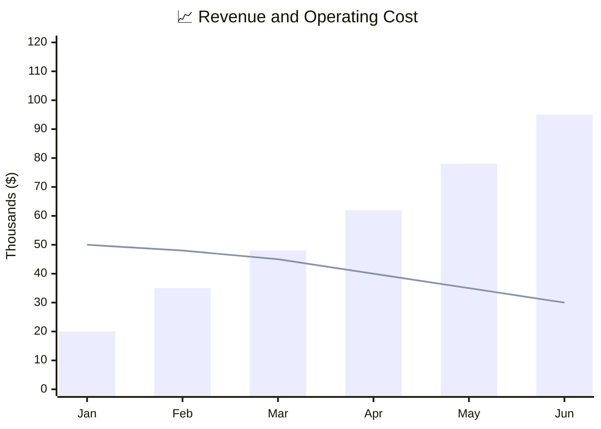
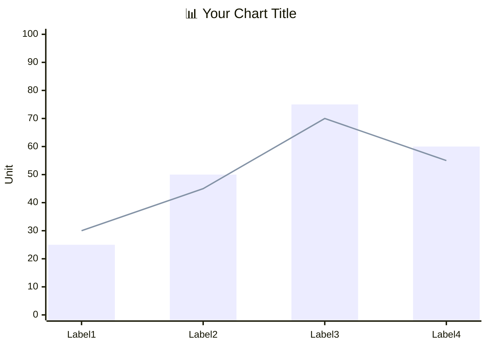

<!-- Source: https://github.com/SuperiorByteWorks-LLC/agent-project | License: Apache-2.0 | Author: Clayton Young / Superior Byte Works, LLC (Boreal Bytes) -->

# XY Chart

> **Back to [Style Guide](../mermaid_style_guide.md)** — Read the style guide first for emoji, color, and accessibility rules.

**Syntax keyword:** `xychart-beta`
**Best for:** Numeric data visualization, trends over time, bar/line comparisons, metric dashboards
**When NOT to use:** Proportional breakdowns (use [Pie](pie.md)), qualitative comparisons (use [Quadrant](quadrant.md))

> **Accessibility:** Mermaid 12.0.0 emits `accTitle`/`accDescr` for this type. Keep a visible description and verify older destination renderers.

---

## Exemplar Diagram

_XY chart comparing illustrative monthly revenue (bars) and operating cost (line), both in thousands of dollars; it does not measure per-customer acquisition cost:_

---

## Tips

- Combine `bar` and `line` only when units and scale are compatible; preserve a data table and state that example values are illustrative
- Use **emoji in the title** for visual flair: `"📈 Revenue Growth"`
- Use quoted `title` and axis labels
- Define axis range with `min --> max`
- Keep data points to **6–12** for readability
- Multiple `bar` or `line` entries add series; bars can overlap rather than group side by side. Named series such as `line "Control" [1, 2]` add a legend in v11.17.0+. Validate appearance on the actual host
- **Always** pair with a detailed Markdown text description above for screen readers

---

## Template

_Description of what the X axis, Y axis, bars, and lines represent and the key insight:_

## Verified reference

Syntax examples reviewed against [official Mermaid documentation](https://mermaid.js.org/syntax/xyChart.html) and rendered with Mermaid 12.0.0 (2026-10-01). Check the destination version; appearance and accessibility are not guaranteed by a successful parse.
